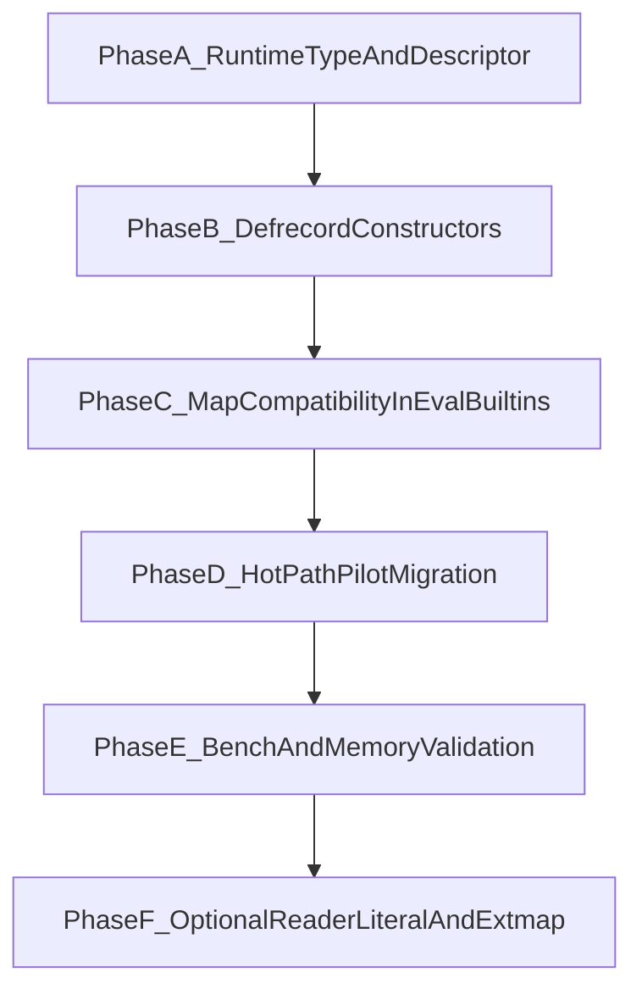

# Implementierungsplan: clojure-records in tiny-clj

## Ziele

- `defrecord`-Support mit **kompaktem, geschlossenem Layout** und **O(1)-Feldzugriff**.
- Keine Regression bei bestehender Map-Nutzung (`get`, Keyword-as-fn, `assoc`/`dissoc`-Verhalten klar definiert).
- Fokus auf echten Hot-Path (Event-Loop, Audio/Renderer-nahe Daten).

## Ausgangspunkt im Code

- Lineare Map-Lookups passieren über `map_get_sentinel` in [subjective-c/src/map.c](/Users/theisen/Projects/tiny-clj/subjective-c/src/map.c).
- Ein vorhandenes O(1)-Muster (Indexzugriff auf definierte Felder) existiert bereits in [src/event_loop.c](/Users/theisen/Projects/tiny-clj/src/event_loop.c) (`TIMER_TASK_IDX`_* + `KV_VALUE(...)`).
- Parser kennt Tagged Literals nur für `#uuid`/`#inst` in [src/parser.c](/Users/theisen/Projects/tiny-clj/src/parser.c) – Record-Literals fehlen.
- Noten/Track-Format nutzt aktuell kleine Step-Maps in [src/tiny-clj.audio.clj](/Users/theisen/Projects/tiny-clj/src/tiny-clj.audio.clj) (`:notes`, `:dur`, `:melody`, `:backing`).

## Architekturentscheidung

- **Record als eigener Runtime-Typ** (nicht nur Meta auf Map), damit schneller Dispatch und fixe Feldreihenfolge möglich sind.
- **Duale Semantik:** Records verhalten sich aus Clojure-Sicht map-kompatibel für Lookup, intern aber indexbasiert.
- **Geschlossenes Layout + optional extmap später:** erste Iteration ohne extmap für geringe Komplexität und klaren Hot-Path-Gewinn.

## Datenmodell (kompakt + schnell)

1. **Type-Tag ergänzen**
  - Neuer Typ in [subjective-c/src/subjective-c/types.h](/Users/theisen/Projects/tiny-clj/subjective-c/src/subjective-c/types.h) (z. B. `CLJ_RECORD`).
2. **Record-Objektstruktur einführen**
  - Felder: `record_type_id` (Symbol/Descriptor), `field_count`, `values[]` (compact array), optional `field_keys[]` im Descriptor statt pro Instanz.
3. **Record-Descriptor cachen**
  - Pro Record-Typ ein Descriptor: Feld-Keywords, Keyword->Index-Mapping (klein, intern), Constructor-Metadaten.
4. **Lookup-API**
  - `record_get_by_index` für Hot-Path.
  - `record_get_by_key` für Clojure-API (`get`, `(:k rec)`), intern key->index + direkter Zugriff.

## Sprachintegration (`defrecord`)

1. **Compiler/Macro-Ebene**
  - `defrecord` als Macro/Builtin auflösen und folgende Artefakte erzeugen:
    - Typ-Descriptor registrieren
    - Konstruktor `->Type`
    - Map-Konstruktor `map->Type`
2. **Reader/Parser**
  - Kein Muss für V1, aber vorbereiten für spätere Reader-Literals (`#Type{...}`) in [src/parser.c](/Users/theisen/Projects/tiny-clj/src/parser.c).
3. **Eval-Integration**
  - Stellen, die heute strikt `is_map` erwarten (z. B. in [src/eval.c](/Users/theisen/Projects/tiny-clj/src/eval.c)), record-kompatibel erweitern:
    - Keyword-Funktionsaufrufe
    - `get`-Pfad
    - ggf. map-as-fn Verhalten dokumentiert angleichen

## Hot-Path-Migration (inkrementell)

1. **Pilot 1: Timer/Task-Strukturen**
  - Muster aus [src/event_loop.c](/Users/theisen/Projects/tiny-clj/src/event_loop.c) als Referenz für Record-Getter nutzen.
2. **Pilot 2: Rendering-/Scene-nahe Daten (wenn vorhanden in CLJ-Ebene)**
  - Nur geschlossene, häufig gelesene Strukturen migrieren.
3. **Nicht-Hot-Path bleibt Map**
  - Konfig, Debug, seltene Meta-Daten explizit bei Maps belassen.

## Noten-Format: Nutzenbewertung

- Für aktuelle `compile-track`-Steps in [src/tiny-clj.audio.clj](/Users/theisen/Projects/tiny-clj/src/tiny-clj.audio.clj) (typisch 2-4 Felder) ist der Gewinn durch Records **moderat**.
- **Empfehlung:**
  - Externe API vorerst map-basiert lassen (lesbar, flexibel).
  - Intern im Compile-Pfad optional in kompaktes internes Step-Record/Vector normalisieren (einmal pro Step), danach nur indexbasiert arbeiten.
- Damit erhältst du API-Stabilität und nutzt Record-Vorteile dort, wo es zählt.

## Test- und Benchmark-Plan

1. **Korrektheit**
  - Neue Tests in [src/tests/test_parser.c](/Users/theisen/Projects/tiny-clj/src/tests/test_parser.c), [src/tests/test_eval.c](/Users/theisen/Projects/tiny-clj/src/tests/test_eval.c) (oder passende vorhandene Eval-Tests) für:
    - `defrecord`, `->Type`, `map->Type`
    - `get`, `(:k rec)`, Equality/Print-Verhalten
2. **Performance**
  - Mikrobenchmarks Map-vs-Record Lookup (N Zugriffe, kleine feste Feldanzahl).
  - Hot-Path-Checks in Event-Loop/Audio-nahen Workloads.
3. **Speicher**
  - Heap-Statistiken vor/nach (insb. viele gleichartige Instanzen).

## Risiken und Gegenmaßnahmen

- **Kompatibilitätsrisiko:** Map-Erwartungen in bestehendem Code -> über gemeinsame Lookup-API kapseln.
- **Komplexitätsrisiko:** extmap/Reader-Literals zu früh -> auf Phase 2 verschieben.
- **Wartbarkeit:** Feldreihenfolge/Indizes müssen stabil sein -> Descriptor zentralisieren und testen.

## Umsetzung in Phasen

## Konkrete Reihenfolge (kurz)

- Runtime-Typ + Descriptor + Lookup-Kern.
- `defrecord` + Konstruktoren.
- Eval/Builtins map-kompatibel für Records.
- Pilotmigration Hot-Path.
- Benchmarks/Memory-Messung, danach optional Reader-Literal/extmap.

