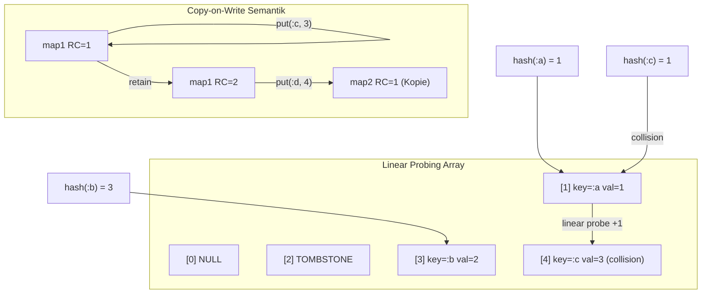

# HashMap mit Linear Probing (Open Addressing) und COW

## API Design Principle

**Die HashMap API muss genauso sein wie die Map API (`map.h`), nur mit `hashmap_` Präfix statt `map_`.**

**Wichtiger Unterschied:**

- **Map API**: Verwendet `ID` Keys (kann CljObject* oder Immediate sein)
- **HashMap API**: Verwendet `const char*` Keys (String-Keys für symbol table)

**Gleiche Funktionen (mit hashmap_ Präfix):**

- `make_hashmap(unsigned int)` ↔ `make_map(int)` (unsigned int is semantically correct)
- `hashmap_get(map, key, not_found)` ↔ `map_get(map, key, not_found)`
- `hashmap_assoc(map, key, value)` ↔ `map_assoc(map, key, value)` (COW)
- `hashmap_put(map, key, value)` ↔ `map_put(map, key, value)` (in-place, void)
- `hashmap_count(map)` ↔ `map_count(map)` (returns int)
- `hashmap_contains(map, key)` ↔ `map_contains(map, key)` (returns int)
- `hashmap_remove(map, key)` ↔ `map_remove(map, key)`
- `hashmap_keys(map)` ↔ `map_keys(map)`
- `hashmap_vals(map)` ↔ `map_vals(map)`
- `hashmap_merge(a, b, overwrite)` ↔ `map_merge(a, b, overwrite)`
- `hashmap_foreach(map, func)` ↔ `map_foreach(map, func)`
- `HASHMAP_FOR_EACH` ↔ `MAP_FOR_EACH`

**Struktur-Unterschiede:**

- `count` und `capacity` sind `unsigned int` (semantisch korrekt, da nie negativ)
- Zusätzlich: `tombstones` (size_t) für Linear Probing

---

## Warum Linear Probing für Embedded?

**Linear Probing ist embedded-freundlicher als Chaining:**

1. **Keine Pointer-Strukturen**: Chaining benötigt Linked Lists pro Bucket → mehr Heap-Allokationen
2. **Bessere Cache-Lokalität**: Alle Daten in einem Array → weniger Cache-Misses
3. **Weniger Speicher-Overhead**: Keine Bucket-Strukturen, nur zwei Arrays (keys/values)
4. **Einfachere Implementierung**: Weniger Code, weniger Fehlerquellen
5. **Vorhersagbare Speicher-Nutzung**: Feste Array-Größe, keine dynamischen Listen

**Trade-off**: Bei hohem Load-Faktor kann Clustering auftreten, aber mit Rehashing bei 75% Load bleibt Performance gut.

## Datenstruktur



**Struktur (gleiches Layout wie CljMap, aber mit String-Keys):**

```c
typedef struct {
    CljObject base;         // type + rc (COW via rc)
    unsigned int count;     // Active entries (never negative, semantically correct)
    unsigned int capacity;  // Array size (2^n for mask, never negative, semantically correct)
    size_t tombstones;      // Deleted slots (for Linear Probing)
    CljObject *data[];      // Embedded array: [key0, value0, key1, value1, ...]
                            // Size: capacity * 2 * sizeof(CljObject*)
                            // Access via KV_KEY() and KV_VALUE() macros
                            // Keys are CljString* (stored as CljObject*)
} CljHashMap;
```

**Vorteile des gleichen Layouts:**

- Konsistenz mit CljMap (gleiche KV_MACROS)
- Bessere Cache-Lokalität (ein Array statt zwei)
- Einfacheres Memory-Management (ein malloc)
- Gleiche Zugriffs-Patterns wie Maps

**Linear Probing Algorithmus:**

1. Hash-Funktion berechnet Start-Index: `idx = hash(key) & mask`
2. Bei Kollision: `idx = (idx + 1) & mask` (wraps around)
3. Stoppt bei: NULL (leerer Slot) oder gefundener Key
4. Tombstones werden übersprungen, aber für Wiederverwendung gemerkt

---

## Schritt 1: Header definieren

Neue Datei [`subjective-c/public/hashmap.h`](subjective-c/public/hashmap.h):

**WICHTIG: API muss genauso sein wie `map.h`, nur mit `hashmap_` Präfix statt `map_`**

**Unterschied:** HashMap verwendet `const char*` Keys (String-Keys), Map verwendet `ID` Keys.

```c
#ifndef SUBJECTIVE_C_HASHMAP_H
#define SUBJECTIVE_C_HASHMAP_H

#include "object.h"
#include "kv_macros.h"
#include "common.h"
#include <stdbool.h>

// Sentinel for deleted entries (Linear Probing)
#define HASHMAP_TOMBSTONE ((CljObject*)(uintptr_t)1)

typedef struct {
    CljObject base;
    unsigned int count;     // Active entries (never negative, semantically correct)
    unsigned int capacity; // Array size (must be 2^n for mask, never negative, semantically correct)
    size_t tombstones;      // Deleted slots (for Linear Probing)
    CljObject *data[];      // Embedded array: [key0, value0, key1, value1, ...]
                            // Size: capacity * 2 * sizeof(CljObject*)
                            // Access via KV_KEY() and KV_VALUE() macros
} CljHashMap;

// Type-safe casting (like as_map in map.h)
static inline CljHashMap* as_hashmap(ID obj) {
    if (obj) {
        int tag = TAG(obj);
        if (tag == CLJ_HASHMAP) {
            return (CljHashMap*)obj;
        }
    }
    CLJ_ASSERT(0 && "Expected HashMap type");
    return NULL;
}

// Map operations (mirroring map.h API with hashmap_ prefix)
CljHashMap* make_hashmap(unsigned int capacity);
static inline CljHashMap* hashmap_empty(void) {
    extern CljHashMap *hashmap_empty_singleton;
    return hashmap_empty_singleton;
}
ID hashmap_get(CljHashMap *map, const char *key, ID not_found);
CljHashMap* hashmap_assoc(CljHashMap* map, const char *key, ID value);
CljHashMap* hashmap_merge(CljHashMap* a, CljHashMap* b, bool overwrite);
ID hashmap_keys(CljHashMap *map);
ID hashmap_vals(CljHashMap *map);
unsigned int hashmap_count(CljHashMap *map);  // Returns unsigned int (never negative)
void hashmap_put(CljHashMap *map, const char *key, ID value);  // In-place (like map_put)
void hashmap_foreach(CljHashMap *map, void (*func)(const char*, ID));
int hashmap_contains(CljHashMap *map, const char *key);  // Returns int (like map_contains)
CljHashMap* hashmap_remove(CljHashMap *map, const char *key);
CljHashMap* make_hashmap_from_stack(CljObject **pairs, int pair_count);
CljHashMap* hashmap_copy_with_additions(CljHashMap *parent_map, CljObject **additions, int addition_count);

// Note: Transient API not needed for HashMap (only for Map)

#define HASHMAP_FOR_EACH(map, key_var, value_var) \
    for (int _i = 0, _cnt = hashmap_count(map); (map) && _i < _cnt; ++_i) \
        for (CljObject **_data_ptr = (map)->data; _data_ptr; _data_ptr = NULL) \
            for (CljString *key_var __attribute__((unused)) = (CljString*)_data_ptr[2*_i], \
                 CljObject *value_var __attribute__((unused)) = _data_ptr[2*_i+1]; _data_ptr; _data_ptr = NULL)

#endif
```

**Test:** `cmake --build build -j4` (kompiliert ohne Fehler)

---

## Schritt 2: Tests schreiben (Test-First)

Neue Datei [`subjective-c/tests/test_hashmap.c`](subjective-c/tests/test_hashmap.c):

| Test | Beschreibung |

|------|-------------|

| `test_hashmap_create` | Erstellen mit verschiedenen Kapazitäten |

| `test_hashmap_put_get_single` | Ein Element einfügen und abrufen |

| `test_hashmap_put_get_multiple` | 10 verschiedene Keys |

| `test_hashmap_linear_probing_collision` | Zwei Keys mit gleichem Hash-Index (Linear Probing) |

| `test_hashmap_overwrite_same_map` | RC=1: gleiche Map zurück |

| `test_hashmap_overwrite_cow` | RC>1: neue Map zurück (COW) |

| `test_hashmap_not_found` | Gibt not_found zurück |

| `test_hashmap_remove_rc1` | RC=1: in-place mit Tombstone |

| `test_hashmap_remove_cow` | RC>1: Kopie ohne den Key |

| `test_hashmap_probe_over_tombstone` | Linear Probing springt über Tombstones |

| `test_hashmap_rehash_on_load` | Automatisch verdoppeln bei Load > 0.75 |

| `test_hashmap_contains` | contains true/false |

| `test_hashmap_cow_independence` | Änderung an Kopie beeinflusst Original nicht |

| `test_hashmap_many_entries` | 1000 Einträge (Linear Probing Performance) |

**Test:** `cmake --build build -j4` (Link-Fehler erwartet - OK)

---

## Schritt 3: Grundimplementierung (create, get, contains) mit Linear Probing

In [`subjective-c/hashmap.c`](subjective-c/hashmap.c):

```c
// FNV-1a Hash (embedded-freundlich: schnell, keine Division)
static inline uint32_t fnv1a(const char *s) {
    uint32_t h = 2166136261u;
    for (; *s; s++) { h ^= (uint8_t)*s; h *= 16777619u; }
    return h;
}

// Next power of 2 (for mask: capacity - 1)
static unsigned int next_power_of_2(unsigned int n) {
    if (n < 8) return 8;
    n--;
    n |= n >> 1; n |= n >> 2; n |= n >> 4;
    n |= n >> 8; n |= n >> 16;
    if (sizeof(unsigned int) > 4) { // For 64-bit systems
        n |= n >> 32;
    }
    return n + 1;
}

CljHashMap* make_hashmap(unsigned int initial_capacity) {  // Like make_map, but with unsigned int (semantically correct)
    unsigned int cap = next_power_of_2(initial_capacity);
    
    // Allocate struct + embedded data array in ONE malloc (wie CljMap)
    size_t struct_size = sizeof(CljHashMap);
    size_t data_size = (size_t)cap * 2 * sizeof(CljObject*);
    size_t total_size = struct_size + data_size;
    
    CljHashMap *map = (CljHashMap*)malloc(total_size);
    if (!map) {
        throw_oom();
    }
    
    map->base.type = CLJ_HASHMAP;
    map->base.rc = 1;
    map->count = 0;
    map->capacity = cap;
    map->tombstones = 0;
    
    // Initialize embedded array to NULL
    for (unsigned int i = 0; i < cap; i++) {
        KV_KEY(map->data, i) = NULL;
        KV_VALUE(map->data, i) = NULL;
    }
    
    return map;
}

// Linear Probing: Find slot (for get/put)
// Uses KV_KEY() macro for consistent access
static unsigned int find_slot(CljHashMap *map, const char *key) {
    unsigned int mask = map->capacity - 1;  // 2^n - 1 for fast modulo
    unsigned int idx = fnv1a(key) & mask;   // Start index
    
    // Linear Probing: bei Kollision einfach +1
    while (KV_KEY(map->data, idx) != NULL) {
        if (KV_KEY(map->data, idx) != HASHMAP_TOMBSTONE) {
            CljString *k = (CljString*)KV_KEY(map->data, idx);
            if (strcmp(k->data, key) == 0) return idx;  // Gefunden
        }
        // Kollision oder Tombstone: Linear Probing
        idx = (idx + 1) & mask;  // Wraps around bei 2^n
    }
    return idx;  // Leerer Slot gefunden
}

ID hashmap_get(CljHashMap *map, const char *key, ID not_found) {  // Like map_get
    if (!map || !key) return not_found;
    unsigned int idx = find_slot(map, key);
    if (KV_KEY(map->data, idx) && KV_KEY(map->data, idx) != HASHMAP_TOMBSTONE) {
        return KV_VALUE(map->data, idx);
    }
    return not_found;
}

int hashmap_contains(CljHashMap *map, const char *key) {  // Like map_contains (returns int)
    if (!map || !key) return 0;
    unsigned int idx = find_slot(map, key);
    return KV_KEY(map->data, idx) != NULL && KV_KEY(map->data, idx) != HASHMAP_TOMBSTONE;
}
```

**Test:** `cmake --build build -j4 && ./subjective-c/subjective-c-tests`

- Erwartung: `test_hashmap_create`, `test_hashmap_put_get_single`, `test_hashmap_linear_probing_collision` grün

---

## Schritt 4: put mit COW und Linear Probing

```c
static CljHashMap* hashmap_copy(CljHashMap *map) {
    // VORTEIL: Saubere Kopie ohne Tombstones
    // - Bessere Performance: Weniger Slots bei Linear Probing
    // - Weniger Speicher: Tombstones nehmen Platz weg
    // - Besserer Load-Factor: (count + tombstones) → count
    // - Weniger Clustering: Tombstones können längere Probe-Sequenzen verursachen
    // - Automatisches Rehashing: Neue Map kann optimale Kapazität haben
    
    CljHashMap *copy = make_hashmap(map->count);  // Optimal capacity based on count
    copy->count = 0;  // Wird beim Einfügen erhöht
    copy->tombstones = 0;  // Sauber, keine Tombstones
    
    // Re-insert all entries (automatic rehashing)
    // Uses KV_KEY() and KV_VALUE() macros
    for (unsigned int i = 0; i < map->capacity; i++) {
        if (KV_KEY(map->data, i) && KV_KEY(map->data, i) != HASHMAP_TOMBSTONE) {
            CljString *k = (CljString*)KV_KEY(map->data, i);
            copy = hashmap_assoc(copy, k->data, KV_VALUE(map->data, i));
            // hashmap_assoc does RETAIN, so no additional RETAIN needed
        }
    }
    return copy;
}

CljHashMap* hashmap_assoc(CljHashMap *map, const char *key, ID value) {  // Like map_assoc (COW)
// void hashmap_put(CljHashMap *map, const char *key, ID value);  // Like map_put (in-place)
    if (!map || !key) return map;
    
    // Rehash if needed (before COW check)
    if (needs_rehash(map)) {
        map = hashmap_rehash(map, map->capacity * 2);
    }
    
    // COW: RC>1 → create copy
    if (map->base.rc > 1) {
        CljHashMap *copy = hashmap_copy(map);
        RELEASE(map);
        map = copy;
    }
    
    // Linear Probing: Find slot (with tombstone reuse)
    unsigned int mask = map->capacity - 1;
    unsigned int idx = fnv1a(key) & mask;
    unsigned int first_tombstone = UINT_MAX;
    
    while (KV_KEY(map->data, idx) != NULL) {
        if (KV_KEY(map->data, idx) == HASHMAP_TOMBSTONE) {
            // Tombstone found - remember for reuse
            if (first_tombstone == UINT_MAX) first_tombstone = idx;
        } else {
            CljString *k = (CljString*)KV_KEY(map->data, idx);
            if (strcmp(k->data, key) == 0) {
                // Key exists - update
                ASSIGN(KV_VALUE(map->data, idx), value);
                return map;
            }
        }
        // Linear Probing: next slot
        idx = (idx + 1) & mask;
    }
    
    // New entry: reuse tombstone or use empty slot
    unsigned int insert_idx = (first_tombstone != UINT_MAX) ? first_tombstone : idx;
    if (first_tombstone != UINT_MAX) map->tombstones--;
    
    KV_ASSIGN_PAIR(map->data, insert_idx, RETAIN(make_clj_string(key)), RETAIN(value));
    map->count++;
    
    return map;
}
```

**Test:** `cmake --build build -j4 && ./subjective-c/subjective-c-tests`

- Erwartung: `test_hashmap_overwrite_*`, `test_hashmap_cow_*` grün

---

## Schritt 5: remove mit COW, Linear Probing über Tombstones

```c
CljHashMap* hashmap_remove(CljHashMap *map, const char *key) {
    if (!map || !key) return map;
    
    // Linear Probing: Find slot
    unsigned int idx = find_slot(map, key);
    if (!KV_KEY(map->data, idx) || KV_KEY(map->data, idx) == HASHMAP_TOMBSTONE) {
        return map;  // Not found
    }
    
    // COW: RC>1 → Clean copy without this key (no tombstones!)
    if (map->base.rc > 1) {
        // ADVANTAGE: New map without tombstones, optimal capacity
        CljHashMap *copy = make_hashmap(map->count - 1);  // count-1 since one key is removed
        for (unsigned int i = 0; i < map->capacity; i++) {
            if (KV_KEY(map->data, i) && KV_KEY(map->data, i) != HASHMAP_TOMBSTONE && i != idx) {
                CljString *k = (CljString*)KV_KEY(map->data, i);
                copy = hashmap_assoc(copy, k->data, KV_VALUE(map->data, i));
            }
        }
        RELEASE(map);
        return copy;
    }
    
    // RC=1: In-place tombstone (Linear Probing can jump over it)
    RELEASE(KV_KEY(map->data, idx));
    RELEASE(KV_VALUE(map->data, idx));
    KV_SET_KEY(map->data, idx, HASHMAP_TOMBSTONE);
    KV_SET_VALUE(map->data, idx, NULL);
    map->count--;
    map->tombstones++;
    
    return map;
}
```

**Test:** `cmake --build build -j4 && ./subjective-c/subjective-c-tests`

- Erwartung: `test_hashmap_remove_*`, `test_hashmap_probe_over_tombstone` grün

---

## Schritt 6: Rehashing mit Linear Probing

```c
static CljHashMap* hashmap_rehash(CljHashMap *map, unsigned int new_capacity) {
    CljHashMap *new_map = make_hashmap(new_capacity);
    
    // Re-insert all entries with Linear Probing
    for (unsigned int i = 0; i < map->capacity; i++) {
        if (KV_KEY(map->data, i) && KV_KEY(map->data, i) != HASHMAP_TOMBSTONE) {
            CljString *k = (CljString*)KV_KEY(map->data, i);
            new_map = hashmap_assoc(new_map, k->data, KV_VALUE(map->data, i));
        }
    }
    
    // Free old map if RC=1 (embedded array is freed with free(map))
    if (map->base.rc == 1) {
        for (unsigned int i = 0; i < map->capacity; i++) {
            if (KV_KEY(map->data, i) && KV_KEY(map->data, i) != HASHMAP_TOMBSTONE) {
                RELEASE(KV_KEY(map->data, i));
                RELEASE(KV_VALUE(map->data, i));
            }
        }
        free(map);  // Embedded array is automatically freed
    }
    
    return new_map;
}
```

**Test:** `cmake --build build -j4 && ./subjective-c/subjective-c-tests`

- Erwartung: `test_hashmap_rehash_on_load`, `test_hashmap_many_entries` grün

---

## Schritt 7: CMakeLists.txt und Typ-Registrierung

1. [`subjective-c/CMakeLists.txt`](subjective-c/CMakeLists.txt) erweitern
2. `CLJ_HASHMAP` zu [`subjective-c/public/types.h`](subjective-c/public/types.h) hinzufügen
3. Destruktor in Memory-System registrieren

**Test:** `cmake --build build -j4 && ./subjective-c/subjective-c-tests` - Alle HashMap-Tests grün

---

## Schritt 8: Symbol-Tabelle umstellen

In [`src/symbol.c`](src/symbol.c):

```c
#include "hashmap.h"

static CljHashMap *g_symbol_table = NULL;

static void ensure_symbol_table(void) {
    if (!g_symbol_table) {
        g_symbol_table = make_hashmap(512);  // 512 = 2^9, good for Linear Probing
    }
}

static void make_symbol_key(char *buf, size_t size, CljSymbol *ns, const char *name) {
    if (ns && ns->cname) {
        snprintf(buf, size, "%s/%s", ns->cname, name);
    } else {
        snprintf(buf, size, "%s", name);
    }
}

CljSymbol* symbol_table_find(CljSymbol *ns_name, const char *cname) {
    ensure_symbol_table();
    char key[512];
    make_symbol_key(key, sizeof(key), ns_name, cname);
    return (CljSymbol*)hashmap_get(g_symbol_table, key, NULL);
}

void symbol_table_add(CljSymbol *symbol) {
    ensure_symbol_table();
    char key[512];
    make_symbol_key(key, sizeof(key), symbol->ns_name, symbol->cname);
    g_symbol_table = hashmap_put(g_symbol_table, key, (ID)symbol);
}
```

**Test:** `cmake --build build -j4 && ./build/unit-tests` - Alle bestehenden Tests grün

---

## Schritt 9: Performance-Test

```bash
hänger.time ./build/tiny-clj-Macros.
repl
 -e "(+ 1 1)"
```

**Erwartung:** 50-100ms statt 833ms (dank O(1) Lookup mit Linear Probing)

---

## Dateien

| Datei | Aktion |

|-------|--------|

| `subjective-c/public/hashmap.h` | Neu |

| `subjective-c/public/types.h` | CLJ_HASHMAP hinzufügen |

| `subjective-c/hashmap.c` | Neu (Linear Probing) |

| `subjective-c/tests/test_hashmap.c` | Neu |

| `subjective-c/CMakeLists.txt` | Erweitern |

| `src/symbol.c` | Refactoren |