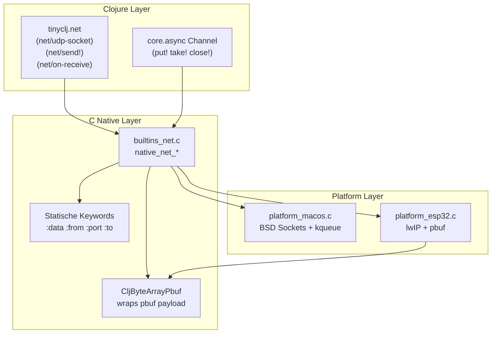

# Netzwerk-API für tiny-clj (Matter-Vorbereitung)

## Architektur



## Zero-Copy Buffer-Modell

**ESP32 (lwIP)**:

- `CljByteArrayPbuf` wraps `pbuf->payload` direkt
- Bei `RELEASE` → `pbuf_free()` 
- Kein `memcpy` der Paketdaten

**macOS (BSD Sockets)**:

- Statischer Buffer-Pool (4 x 1500 Bytes) für Tests
- `CljByteArrayView` mit borrowed flag

## Statische Keywords ([`src/symbol.c`](src/symbol.c))

```c
// Channel Keywords (existierend → migrieren)
DEFINE_STATIC_SYMBOL(sym_kw_value_data, ":value");
DEFINE_STATIC_SYMBOL(sym_kw_closed_data, ":closed");

// Network Keywords (neu)
DEFINE_STATIC_SYMBOL(sym_kw_data_data, ":data");
DEFINE_STATIC_SYMBOL(sym_kw_from_data, ":from");
DEFINE_STATIC_SYMBOL(sym_kw_to_data, ":to");
DEFINE_STATIC_SYMBOL(sym_kw_port_data, ":port");
```

## API Design (Callback-Style mit Channels)

```clojure
;; UDP Socket erstellen
(def sock (net/udp-socket {:port 5000}))

;; Empfang mit Callback (direkt)
(net/on-receive sock 
  (fn [{:keys [data from port]}]
    (println "From:" from ":" port)
    (process-packet data)))  ; data = Zero-Copy ByteArray

;; ODER: In Channel leiten für spätere Verarbeitung
(def recv-ch (chan 10))
(net/on-receive sock (fn [msg] (put! recv-ch msg)))

;; Verarbeitung aus Channel (Callback-Style)
(defn process-loop []
  (take! recv-ch 
    (fn [msg]
      (when msg
        (process msg)
        (process-loop)))))  ; Rekursiv für Loop
(process-loop)

;; Senden
(net/send! sock {:to "192.168.1.1" :port 5353 :data my-bytes})

;; Schließen
(net/close! sock)
```

**Hinweis**: go-blocks (`go`, `<!`, `>!`) sind nicht implementiert.

Die Channel-API nutzt Callbacks (`put!`, `take!`, `close!`).

## Implementierungsreihenfolge (Test-First)

### Phase 1: Foundation

1. Statische Keywords in `symbol.c` hinzufügen + Tests
2. `CljByteArrayView` (borrowed buffer) in `byte_array.c` + Tests
3. Migriere `channel.c` auf statische `:value`/`:closed` Keywords

### Phase 2: Platform Layer

4. `platform.h` erweitern mit Network-API Signaturen
5. `platform_macos.c`: BSD Sockets + kqueue Event-Loop + Tests
6. `platform_esp32_embedded.c`: lwIP UDP/TCP + pbuf-Integration

### Phase 3: Clojure Bindings

7. `builtins_net.c`: Native Functions + Channel-Integration + Tests
8. `libs/tinyclj/net.clj`: Clojure API Wrapper

## Dateien

| Datei | Änderung |

|-------|----------|

| [`src/symbol.c`](src/symbol.c) | +20 Zeilen: Statische Network-Keywords |

| [`subjective-c/src/byte_array.c`](subjective-c/src/byte_array.c) | +50 Zeilen: `make_byte_array_view()` |

| [`src/channel.c`](src/channel.c) | Refactor: Nutze statische Keywords |

| [`src/platform.h`](src/platform.h) | +30 Zeilen: Network API Signaturen |

| [`src/platform_macos.c`](src/platform_macos.c) | +200 Zeilen: BSD Sockets Implementation |

| [`src/platform_esp32_embedded.c`](src/platform_esp32_embedded.c) | +200 Zeilen: lwIP Implementation |

| `src/builtins_net.c` (neu) | ~300 Zeilen: Native Network Functions |

| `libs/tinyclj/net.clj` (neu) | ~50 Zeilen: Clojure API |

## RAM-Bilanz (pro UDP-Paket)

| Komponente | Mit Copy | Zero-Copy |

|------------|----------|-----------|

| Paketdaten (1400 Bytes) | 1400 | 0 |

| ByteArray struct | 16 | 24 (+ pbuf ptr) |

| Keywords (:data, :from, :port) | ~120 | 0 (Flash) |

| Map struct | 48 | 48 |

| **Gesamt** | **~1584** | **~72** |

Ersparnis: **~95%** pro Paket