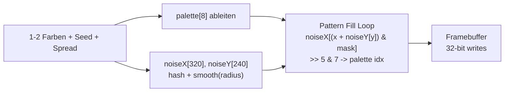

# Background Pattern Fill

Live-Preview: [experiments/pattern-preview.html](experiments/pattern-preview.html)

## Kernidee

Zwei geglaettete 1D-Noise-Arrays mit **Warp** (nicht Addition) erzeugen ein organisches Muster ohne Tartan-Artefakte. Eine enge **8er-Palette** (aus 1-2 Farben abgeleitet, default 25% Spread) sorgt fuer sanfte Uebergaenge statt harter Pixelspruenge. Kein Tile-Buffer, keine Wiederholung, Single-Pass mit 32-Bit-Writes.



## 1. Solid-Clear optimieren (32-Bit-Writes)

Aktuell in [src/vector_scene_graph.c](src/vector_scene_graph.c) (Zeile 56-63 und 592-607): pixelweiser 16-Bit-Store. Ersetzen durch 32-Bit-Writes (zwei Pixel pro Store). Betrifft `vg_framebuffer_clear` und `vg_framebuffer_clear_rect`.

## 2. Palette-Ableitung aus 1-2 Farben (RGB565)

Neue Funktion `vg_pattern_build_palette` in [src/vector_scene_graph.c](src/vector_scene_graph.c):

- **Eingabe**: `color_a`, `color_b` (RGB565), `spread` (0-100, default 25)
- **Algorithmus**: Mittelpunkt `mid = lerp(ca, cb, 0.5)` berechnen, dann 8 Stufen symmetrisch verteilen. Jede Stufe interpoliert zwischen `mid` und der naeheren Endfarbe, skaliert mit `spread/100`.
- **Ergebnis**: `uint16_t palette[8]`
- Enge Spreizung (25%) ergibt sanfte Uebergaenge, kein Schwarz, kein Weiss.

Wird einmal pro Szenenwechsel aufgerufen, nicht pro Frame.

## 3. 1D-Noise-Arrays generieren (mit Glaettung)

Neue Funktion `vg_pattern_generate`, einmal pro Szenenwechsel:

1. **Roh-Hash**: `raw[i] = hash1d(i, seed) & 0xFF` fuer beide Arrays
2. **Glaettung**: Laufender Mittelwert mit konfigurierbarem Radius (default 8). Erzeugt zusammenhaengende Farbklumpen statt Pixel-Rauschen.

```c
static uint8_t noise_x[320];
static uint8_t noise_y[240];
```

Speicherbedarf: **560 Bytes** (plus temporaer 560 Bytes fuer Roh-Arrays beim Generieren). Kein Tile-Buffer.

## 4. Pattern-Fill-Funktion (Single Pass, 32-Bit-Writes)

Neue Funktion `vg_framebuffer_pattern_rect` in [src/vector_scene_graph.c](src/vector_scene_graph.c):

**Warp-Ansatz** (nicht Addition, kein Tartan):

```c
void vg_framebuffer_pattern_rect(VgFrameBuffer *fb, VgClipRect rect,
                                  const uint16_t palette[8],
                                  const uint8_t *noise_x, uint16_t noise_x_len,
                                  const uint8_t *noise_y) {
    uint16_t x_mask = noise_x_len - 1;  // power-of-2
    for (int y = y0; y < y1; y++) {
        uint8_t vy = noise_y[y];
        uint16_t *row = &fb->pixels[y * fb->width + x0];
        for (int x = x0; x < x1; x += 2) {
            uint8_t idx0 = (noise_x[(x     + vy) & x_mask] >> 5) & 7;
            uint8_t idx1 = (noise_x[(x + 1 + vy) & x_mask] >> 5) & 7;
            *(uint32_t *)row = palette[idx0] | ((uint32_t)palette[idx1] << 16);
            row += 2;
        }
    }
}
```

Pro Pixel: **1 Array-Lookup + 1 Add + 1 AND + 1 Shift + 1 Palette-Lookup**. `vy` konstant pro Zeile. 32-Bit-Writes. Nahezu identische Kosten wie optimierter Solid-Clear.

## 5. Szenen-Integration (minimale Aenderung)

`:erase-color` Typ-Dispatch: Fixnum -> Solid-Clear, Vektor -> Pattern-Fill.

- **Fixnum** (wie bisher): `vg_framebuffer_clear_rect(fb, rect, color)`
- **Vektor** `[color-a color-b seed]` oder `[color-a color-b seed spread]`: Pattern-Fill

`VgRenderSlot` in [src/vector_scene_graph.h](src/vector_scene_graph.h) erweitern:

```c
typedef struct {
    // ... bestehende Felder ...
    uint16_t clear_color;
    bool has_pattern;
    uint16_t pattern_palette[8];
    uint32_t pattern_seed;
} VgRenderSlot;
```

Aenderungen in [src/scene.c](src/scene.c) bei `vg_decode_frame_slot_record` und den beiden Clear-Stellen (Zeile 1686, 1874): Typ von `erase_color` pruefen, Vektor-Felder auslesen, Palette + Noise-Arrays erzeugen.

## 6. Breakout-Szene anpassen

In [libs/tiny-breakout/scene.clj](libs/tiny-breakout/scene.clj) statt `:erase-color 0`:

```clojure
:erase-color [0xC3A0 0xE600 42]  ;; warmes Gold, seed 42
```

## 7. Unit-Tests

In [src/tests/test_vector_scene_graph.c](src/tests/test_vector_scene_graph.c):

- Test: optimierter Solid-Clear erzeugt gleiche Ergebnisse wie vorher
- Test: Pattern-Fill-Pixel sind alle aus `palette[0..7]`, korrekte Rect-Grenzen
- Test: Palette-Ableitung aus 1 bzw. 2 Farben mit verschiedenen Spread-Werten
- Test: 1D-Warp erzeugt keine Tartan-Struktur (Zeilenvergleich)

