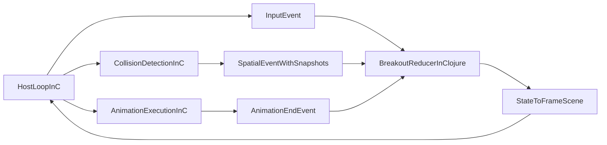

# Breakout nach Clojure ziehen

## Zielbild

Breakout wird in zwei klar getrennte Schichten geschnitten:

- Clojure enthaelt alle Breakout-spezifischen Regeln, State-Uebergaenge, Collision-Reaktion, Szenenableitung und Audio-Entscheidungen.
- C bleibt eine generische Game-/Viewer-Library fuer Host-Loop, Rendern, Animationsausfuehrung, Collision-Snapshots, Event-Zustellung und Runtime-Introspection.

## Was heute noch falsch geschnitten ist

- [src/game_demo_minifb.c](src/game_demo_minifb.c) enthaelt noch eine komplette native Breakout-Runtime: `ViewerBreakoutRuntime`, Phasen, Ball-/Paddle-/Brick-Logik, Score/Lives, Levelwechsel, Szenebau und Input-Auswertung.
- [libs/tiny-breakout/core.clj](libs/tiny-breakout/core.clj) und [libs/tiny-breakout/scene.clj](libs/tiny-breakout/scene.clj) modellieren dieselbe Domaene bereits in Clojure, sind im Host-Pfad aber nicht autoritativ.
- [libs/tiny-clj/deployment.clj](libs/tiny-clj/deployment.clj) ist schon der richtige Adapter-Ort, reicht aber aktuell nur bis Bootstrap und diskreter Input-Weitergabe.

## Zielgrenzen der Module

- Breakout-spezifisch in Clojure:
[libs/tiny-breakout/core.clj](libs/tiny-breakout/core.clj), [libs/tiny-breakout/input.clj](libs/tiny-breakout/input.clj), [libs/tiny-breakout/scene.clj](libs/tiny-breakout/scene.clj), [libs/tiny-breakout/audio.clj](libs/tiny-breakout/audio.clj) plus ein neues Modul fuer Collision-Event-Uebersetzung.
- Generisch in C:
[src/scene.c](src/scene.c), [src/vector_scene_graph.c](src/vector_scene_graph.c), [src/rendered_state_snapshot.c](src/rendered_state_snapshot.c), [src/viewer_collision.c](src/viewer_collision.c), [src/event_loop.c](src/event_loop.c), [src/renderer_lifecycle.c](src/renderer_lifecycle.c) und die generischen Teile aus [src/game_demo_minifb.c](src/game_demo_minifb.c), die in Host-/Viewer-/Spatial-Library-Code ueberfuehrt werden.

## Migrationsplan

1. Native Breakout-Runtime aus C identifizieren und einfrieren.
  Alles unter `viewer_breakout_*`, `ViewerBreakoutRuntime`, `ViewerBreakoutBrick`, `ViewerBreakoutLevel`, `g_breakout_runtime` in [src/game_demo_minifb.c](src/game_demo_minifb.c) als Domaenenlogik markieren, nicht weiter ausbauen und als Rueckbauziel behandeln.
2. Clojure als einzige Breakout-Quelle definieren.
  [libs/tiny-clj/deployment.clj](libs/tiny-clj/deployment.clj) zum zentralen Adapter machen: Inputs, `SpatialEvent`s, spaetere `animation-end`- und Maintenance-Events muessen dort in Breakout-Domain-Events uebersetzt und in `game_state_atom`/`game_scene_atom` verarbeitet werden.
3. Breakout-Domaene in Clojure sauber aufteilen.
  Die Breakout-Clojure-Seite in klare Rollen schneiden:
  - `tiny-breakout.core` oder `tiny-breakout.state`: autoritativer Reducer
  - neues Modul fuer Collision-Event -> Domain-Event
  - [libs/tiny-breakout/scene.clj](libs/tiny-breakout/scene.clj): reine Projektion `state -> FrameScene`
  - [libs/tiny-breakout/audio.clj](libs/tiny-breakout/audio.clj): reine Cue-Ableitung
4. Animationen als generische C-Engine-Faehigkeit definieren.
  Die C-Seite soll Animationen und Timelines generisch ausfuehren, aber keine Breakout-Regeln kennen. Clojure publiziert Szenen mit den benoetigten Animationen und reagiert auf diskrete `animation-end`-Events oder Kollisions-Events durch neuen State und neue Szene.
5. Collision-Pipeline generisch abschliessen.
  Die generische Spatial-Runtime in C soll auf expandierten Policies arbeiten, Snapshot-Events mit beteiligten Objekten liefern und keinerlei Breakout-Wissen mehr enthalten. Rule-Expansion, Policy-Pflege und semantische Reaktion bleiben in Clojure.
6. Viewer-/Host-Config verallgemeinern.
  Den heutigen Breakout-Sondervertrag in [src/game_demo_minifb.c](src/game_demo_minifb.c) auf einen generischen Host-Config-Vertrag reduzieren: Slots, generische Callbacks, optionale Animation-End-Events, Collision-Events. `:native-breakout` und `:game-state-atom` als C-seitige Gameplay-Abhaengigkeiten sollen verschwinden.
7. Breakout-Szenebau voll nach Clojure verlagern.
  Alle breakout-spezifischen HUD-/Overlay-Texte, Entity-IDs, Brick-Materialisierung, In-Place-Szenenupdates und festen Geometrieannahmen aus [src/game_demo_minifb.c](src/game_demo_minifb.c) entfernen. Die laufende Szene kommt nur noch aus [libs/tiny-breakout/scene.clj](libs/tiny-breakout/scene.clj).
8. Input und Audio vereinheitlichen.
  Der Host soll nur generische Input-Events liefern. Die Breakout-Bedeutung von `left/right/fire/pause` bleibt in [libs/tiny-breakout/input.clj](libs/tiny-breakout/input.clj). Breakout-Audio bleibt ein Clojure-Domain-Event-zu-Cue-Adapter.
9. Tests an der Zielarchitektur ausrichten.
  Native Breakout-Runtime-Tests in C schrittweise durch generische Host-/Spatial-/Segment-Tests in C und Breakout-Domain-/Projektions-Tests in Clojure oder Contract-Tests ersetzen. Der Rueckbau von [src/tests/test_breakout_runtime_startup.c](src/tests/test_breakout_runtime_startup.c) sollte explizit eingeplant werden.
10. Rueckbau der nativen Breakout-Sonderpfade.
  Wenn generische Animation, Collision-Snapshots und Deployment-Adapter stehen, `viewer_breakout_runtime_enabled()`, `viewer_breakout_runtime_init_from_state()`, `viewer_breakout_runtime_activate()` und `viewer_breakout_runtime_step()` vollstaendig entfernen.

## Wichtige Leitlinien

- Persistente, abgeleitete Runtime-Daten in Clojure nur dann global halten, wenn sie wirklich wiederverwendet werden.
- Generische C-APIs ohne Breakout-Begriffe benennen und testen.
- Keine zweite Source of Truth in C mehr zulassen.
- Snapshot-Events muessen die beteiligten Objekte im Kollisionszustand tragen.
- Animation-End-Events bleiben Opt-in, damit unmarkierte Timelines keinen Overhead erzeugen.
