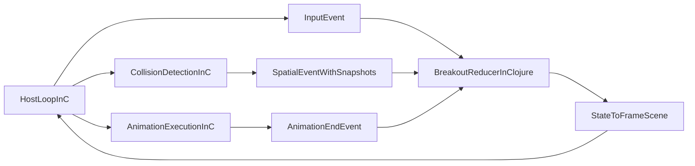

# Breakout nach Clojure ziehen

## Zielbild

Breakout wird in zwei klar getrennte Schichten geschnitten:

- Clojure enthaelt alle Breakout-spezifischen Regeln, State-Uebergaenge, Collision-Reaktion, Szenenableitung und Audio-Entscheidungen.
- C bleibt eine generische Game-/Viewer-Library fuer Host-Loop, Rendern, Animationsausfuehrung, Collision-Snapshots, Event-Zustellung und Runtime-Introspection.

## Aktueller Stand

- Breakout laeuft inzwischen Clojure-autoritativ ueber `tiny-breakout.core`, `tiny-breakout.scene`, `tiny-breakout.runtime` und `tiny-breakout.audio`.
- `libs/tiny-clj/deployment.clj` bootstrapt den Host direkt ueber `tiny-breakout.runtime/bootstrap-runtime!`, liefert die generische Slot-/Callback-Config und haelt keinen nativen Breakout-Sondervertrag mehr offen.
- `:fire`, `:left`, `:right` und `:pause` werden ueber generische Button-Events in den Clojure-Reducer gespeist; der erste Ball startet wieder direkt aus dem Titelbildschirm.
- Breakout-Audio ist jetzt ueber Clojure-Domain-Events an den nativen Sound-Adapter `tiny-fx.sound-native` verdrahtet.
- Die Runtime-Schichten sind weiter geschnitten: `tiny-breakout.runtime` haelt State-/Scene-Publishing und Timeline-/Timer-Verkabelung, `tiny-breakout.runtime-play` kapselt Input-Normalisierung, Paddle-Motion und die unmittelbare Runtime-Reaktion auf Host-/Spatial-Events.
- Der GFX-Record-Schema-Pfad ist jetzt explizit: `tiny-fx.gfx-records` definiert die kanonischen Records in Clojure, und die C-Seite validiert/deserialisiert nur noch dagegen statt Records selbst zu registrieren.
- Runloop-/Deferred-Callback-Exceptions werden jetzt auch ausserhalb von Debug-Builds nach `stderr` gedruckt, statt still zu verschwinden.

## Was heute noch falsch geschnitten ist

- [src/game_demo_minifb.c](src/game_demo_minifb.c) traegt noch zu viel generische Host-/Viewer-/Input-Infrastruktur in einer Datei und sollte weiter in breakout-unabhaengige C-Library-Schichten zerlegt werden.
- [src/tests/test_breakout_runtime_startup.c](src/tests/test_breakout_runtime_startup.c) deckt noch einen Teil der historischen Host-Verkabelung ab und sollte weiter auf generische Startup-/Viewer-Contracts reduziert werden.
- `tiny-breakout.runtime-play` enthaelt noch Breakout-spezifische Runtime-Glue-Logik wie Paddle-Motion, gerenderte Positions-Synchronisierung und Event-Normalisierung. Das ist in Clojure richtig aufgehoben, aber noch nicht die sauberste Endgrenze zwischen Domain-Reducer und Host-Verkabelung.
- Die C-Seite hat noch Breakout-benannte Host-Verkabelung, z. B. direkte Aufloesung von `tiny-breakout.runtime/apply-input!` in [src/game_demo_minifb.c](src/game_demo_minifb.c) und breakout-benannte Symbol-/Config-Pfade in [src/viewer_host_slots.c](src/viewer_host_slots.c). Diese Pfade sollten weiter auf generische Viewer-/Deployment-Begriffe reduziert werden.
- `:game-scene-atom` ist weiterhin Teil des Deployment-/Viewer-Vertrags. Das ist funktional generisch nutzbar, aber der Plan sollte weiter auf einen moeglichst kleinen, breakout-unabhaengigen Host-Contract zielen.

## Naechster konkreter Schritt

Der naechste Umbau sollte `extract-generic-c-runtime` praktisch beginnen und zwei Dinge gleichzeitig erreichen:

1. Breakout-spezifische C-Verkabelung hinter einen generischen Viewer-/Deployment-Vertrag schieben.
2. Den generischen Charakter auch in C-Datei- und API-Namen sichtbar machen.

### Ziel des naechsten Schnitts

- [src/game_demo_minifb.c](src/game_demo_minifb.c) darf danach nicht mehr als impliziter Breakout-Host gelten, sondern als generische Host-App fuer den Viewer.
- [src/viewer_host_slots.c](src/viewer_host_slots.c) darf keine breakout-benannte Fast-Path-API mehr exponieren.
- Breakout-spezifische Tests sollen den generischen Host-Vertrag konsumieren, nicht private Breakout-C-Helfer.

### Konkrete Rename-Richtung fuer C-Dateien

Diese Umbenennungen sollen den naechsten Schnitt begleiten:

- `src/game_demo_minifb.c` -> `src/fx_host_app.c`
- `src/viewer_host_slots.c` -> `src/fx_config_loader.c`
- `src/viewer_host_slots.h` -> `src/fx_config_loader.h`
- `src/viewer_collision_bridge.h` -> `src/fx_spatial_bridge.h`
- `src/viewer_collision_scene_bridge.c` -> `src/fx_spatial_scene_bridge.c`
- `src/viewer_collision_dispatch.c` -> `src/fx_spatial_dispatch.c`

Bewusste Nicht-Ziele fuer diesen Schritt:

- `src/fx_collision.c` muss nicht sofort umbenannt werden, solange dort bereits klar generische Spatial-/Collision-Infrastruktur liegt.
- `src/fx_host_runloop.c` kann vorerst bleiben; der groesste irrefuehrende Name ist aktuell `game_demo_minifb.c`.

### Konkrete inhaltliche Schritte im selben PR-Slice

1. `game_demo_minifb` in generischen Host-App-Namen ueberfuehren.
   Die Datei soll nur noch Viewer-Host-App-/Window-/Renderloop-Semantik tragen. Breakout-spezifische Begriffe in Funktionsnamen, Kommentaren und Fehlermeldungen werden auf generische Viewer-/Deployment-Begriffe umgestellt.

2. `viewer_load_breakout_host_config_fast()` generisch umbenennen und verallgemeinern.
   Zielname: `viewer_load_deployment_config_fast()` oder `viewer_load_runtime_config_fast()`.
   Der Fast-Path soll ueber den generischen Deployment-Vertrag sprechen (Scene-Atom, Prepare-/Startup-/Spatial-Callback), nicht ueber Breakout-Begriffe.

3. Breakout-spezifische String-Lookups in C auf generische Deployment-Begriffe reduzieren.
   Direkte `tiny-breakout.runtime/...`-Aufloesungen in C bleiben nur dann temporaer bestehen, wenn sie klar als Zwischenzustand dokumentiert sind; bevorzugt wird die Aufloesung ueber den Deployment-Config-Pfad.

4. `test_breakout_runtime_startup.c` sprachlich und strukturell in Richtung generischer Startup-/Viewer-Contracts schieben.
   Breakout-spezifische Assertions bleiben nur dort, wo wirklich Domain-Verhalten getestet wird.

### Review-Gate fuer den naechsten Schritt

- Keine zentralen generischen Host-Dateien tragen noch `game_demo` oder `breakout` im Dateinamen, wenn sie breakout-unabhaengige Infrastruktur enthalten.
- Der Haupt-Config-Lader in C ist generisch benannt und beschreibt einen Viewer-/Deployment-Vertrag statt einen Breakout-Sonderfall.
- Ein Leser kann aus Dateinamen und Top-Level-APIs erkennen, welche Teile generische Viewer-Infrastruktur sind und welche Teile echte Breakout-Domaene bleiben.

## Zielgrenzen der Module

- Breakout-spezifisch in Clojure:
[libs/tiny-breakout/core.clj](libs/tiny-breakout/core.clj), [libs/tiny-breakout/runtime.clj](libs/tiny-breakout/runtime.clj), [libs/tiny-breakout/runtime-play.clj](libs/tiny-breakout/runtime-play.clj), [libs/tiny-breakout/scene.clj](libs/tiny-breakout/scene.clj), [libs/tiny-breakout/audio.clj](libs/tiny-breakout/audio.clj) plus optional spaeter ein explizites Modul fuer Collision-Event-Uebersetzung.
- Generisch in C:
[src/scene.c](src/scene.c), [src/vector_scene_graph.c](src/vector_scene_graph.c), [src/rendered_state_snapshot.c](src/rendered_state_snapshot.c), [src/fx_collision.c](src/fx_collision.c), [src/event_loop.c](src/event_loop.c), [src/renderer_lifecycle.c](src/renderer_lifecycle.c) und die generischen Teile aus [src/game_demo_minifb.c](src/game_demo_minifb.c), die in Host-/Viewer-/Spatial-Library-Code ueberfuehrt werden.

## Migrationsplan

1. Native Breakout-Runtime aus C identifizieren und einfrieren.
  Alles unter `viewer_breakout_*`, `ViewerBreakoutRuntime`, `ViewerBreakoutBrick`, `ViewerBreakoutLevel`, `g_breakout_runtime` in [src/game_demo_minifb.c](src/game_demo_minifb.c) als Domaenenlogik markieren, nicht weiter ausbauen und als Rueckbauziel behandeln.
2. Clojure als einzige Breakout-Quelle definieren.
  [libs/tiny-clj/deployment.clj](libs/tiny-clj/deployment.clj) zum zentralen Adapter machen: Inputs, `SpatialEvent`s, spaetere `animation-end`- und Maintenance-Events muessen dort in Breakout-Domain-Events uebersetzt und in `game_state_atom`/`game_scene_atom` verarbeitet werden.
3. Breakout-Domaene in Clojure sauber aufteilen.
  Die Breakout-Clojure-Seite in klare Rollen schneiden:
  - `tiny-breakout.core` oder `tiny-breakout.state`: autoritativer Reducer
  - `tiny-breakout.runtime`: State-/Scene-Publishing, Segment-Watches, Timer-/Timeline-Verkabelung
  - `tiny-breakout.runtime-play`: Input-Normalisierung und unmittelbare Runtime-Reaktion auf Host-/Spatial-Events
  - optional neues Modul fuer Collision-Event -> Domain-Event, falls `tiny-breakout.runtime` weiter schrumpfen soll
  - [libs/tiny-breakout/scene.clj](libs/tiny-breakout/scene.clj): reine Projektion `state -> FrameScene`
  - [libs/tiny-breakout/audio.clj](libs/tiny-breakout/audio.clj): reine Cue-Ableitung
4. Animationen als generische C-Engine-Faehigkeit definieren.
  Die C-Seite soll Animationen und Timelines generisch ausfuehren, aber keine Breakout-Regeln kennen. Clojure publiziert Szenen mit den benoetigten Animationen und reagiert auf diskrete `animation-end`-Events oder Kollisions-Events durch neuen State und neue Szene.
5. Collision-Pipeline generisch abschliessen.
  Die generische Spatial-Runtime in C soll auf expandierten Policies arbeiten, Snapshot-Events mit beteiligten Objekten liefern und keinerlei Breakout-Wissen mehr enthalten. Rule-Expansion, Policy-Pflege und semantische Reaktion bleiben in Clojure.
6. Viewer-/Host-Config verallgemeinern.
  Den heutigen Breakout-Sondervertrag in [src/game_demo_minifb.c](src/game_demo_minifb.c) auf einen generischen Host-Config-Vertrag reduzieren: Slots, generische Callbacks, optionale Animation-End-Events, Collision-Events. `:native-breakout` und `:game-state-atom` als C-seitige Gameplay-Abhaengigkeiten sollen verschwinden.
7. Breakout-Szenebau voll nach Clojure verlagern.
  Alle breakout-spezifischen HUD-/Overlay-Texte, Entity-IDs, Brick-Materialisierung, In-Place-Szenenupdates und festen Geometrieannahmen aus [src/game_demo_minifb.c](src/game_demo_minifb.c) entfernen. Die laufende Szene kommt nur noch aus [libs/tiny-breakout/scene.clj](libs/tiny-breakout/scene.clj).
8. Input und Audio vereinheitlichen.
  Der Host soll nur generische Input-Events liefern. Die Breakout-Bedeutung von `left/right/fire/pause` bleibt in [libs/tiny-breakout/runtime.clj](libs/tiny-breakout/runtime.clj). Breakout-Audio bleibt ein Clojure-Domain-Event-zu-Cue-Adapter.
9. Tests an der Zielarchitektur ausrichten.
  Native Breakout-Runtime-Tests in C schrittweise durch generische Host-/Spatial-/Segment-Tests in C und Breakout-Domain-/Projektions-Tests in Clojure oder Contract-Tests ersetzen. Der Rueckbau von [src/tests/test_breakout_runtime_startup.c](src/tests/test_breakout_runtime_startup.c) sollte explizit eingeplant werden.
10. Rueckbau der nativen Breakout-Sonderpfade.
  Wenn generische Animation, Collision-Snapshots und Deployment-Adapter stehen, `viewer_breakout_runtime_enabled()`, `viewer_breakout_runtime_init_from_state()`, `viewer_breakout_runtime_activate()` und `viewer_breakout_runtime_step()` vollstaendig entfernen.

## Wichtige Leitlinien

- Persistente, abgeleitete Runtime-Daten in Clojure nur dann global halten, wenn sie wirklich wiederverwendet werden.
- Generische C-APIs ohne Breakout-Begriffe benennen und testen.
- Keine zweite Source of Truth in C mehr zulassen.
- Namespace-/Schema-Ladepfade explizit halten; keine impliziten Breakout- oder GFX-Initialisierungen aus beliebigen C-Threads.
- Snapshot-Events muessen die beteiligten Objekte im Kollisionszustand tragen.
- Animation-End-Events bleiben Opt-in, damit unmarkierte Timelines keinen Overhead erzeugen.
- Runloop-/Deferred-Callback-Exceptions duerfen nicht still verschwinden; sie muessen mindestens nach `stderr` sichtbar werden.
