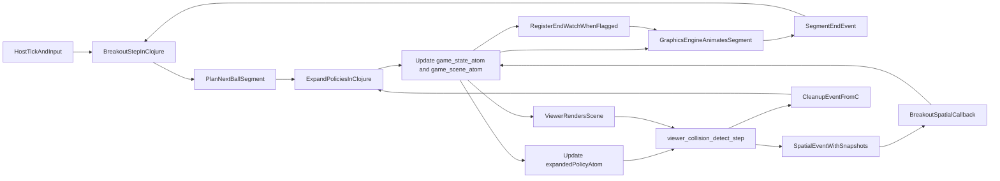

# Breakout auf Collision-Pipeline umstellen

## Stand dieses Durchgangs

- Status: Plan weitgehend umgesetzt. Die Collision-Bridge ist in Runtime- und Rule-/Event-Module aufgeteilt; offen ist nur noch Cleanup.

- Umgesetzt: `libs/tiny-breakout/scene.clj` liefert jetzt ein entity-map-basiertes `FrameScene.root` mit `'root`-Group, stabilen Ball-/Paddle-/Brick-Prototypen und konkret expandierten `SpatialRule`s fuer `:ball-vs-paddle` sowie jedes aktive `:ball-vs-brick`-Paar.
- Umgesetzt: Tiny-FX trennt fuer Pilot-Szenen jetzt `:root` als Traversal-Einstieg von `:index` als Entity-Map. Breakout und das Game-Demo publizieren diese Form bereits, waehrend der Renderer alte root-map-Szenen vorerst noch lesen kann.
- Umgesetzt: `libs/tiny-clj/deployment.clj` leitet Breakout-`spatial-callback`s jetzt ueber den generischen Dispatcher `tiny-fx.gfx-collision/invoke-collision-callback!`, so dass die bestehende Watcher-Infrastruktur fuer Spatial-Events greift.
- Umgesetzt: `src/game_demo_minifb.c` publiziert native Breakout-Szenen jetzt ebenfalls im neuen `:root`/`:index`-Format; der alte Breakout-Sonderfall zum Beibehalten geladener Rules bei nicht-konformen Roots ist entfallen.
- Umgesetzt: Der Host laedt jetzt alle konkreten Breakout-Policies statt sie bei 16 Eintraegen abzuschneiden, und `SpatialEvent` transportiert zusaetzlich `:self-entity` sowie `:other-entity` aus dem Kollisionsframe. Fuer den Uebergang kann der Host diese Snapshots sowohl aus entity-map-Roots als auch aus dem nativen `Group`-Root aufloesen.
- Umgesetzt: Der native Breakout-Hot-Path aktualisiert Paddle/Ball/HUD/Overlay jetzt in-place auf dem bereits publizierten Szenengraphen; neue Szenen werden nur noch bei echten Layoutwechseln wie Staging-Transition oder Levelwechsel gebaut.
- Umgesetzt: Brick-Records bleiben innerhalb eines Levels stabil und werden bei Treffern nur deaktiviert bzw. unsichtbar gemacht. Dadurch entfaellt das frameweise Neuaufbauen des Szenengraphen bei Brick-Hits.
- Umgesetzt: Regressionstests decken jetzt Root-Shape, Prototyp-/Rule-Vertrag, generischen Spatial-Callback-Dispatch, in-place Scene-Reuse, den `level-clear`-Uebergang zum naechsten Level, konkrete Breakout-Policies im Host-Startup-Pfad und `SpatialEvent`-Entity-Snapshots ab.
- Umgesetzt: Die Host-Collision-Pipeline ist jetzt zweiphasig: `viewer_collision_detect_step()` erkennt nur noch Treffer und puffert rohe Hits, waehrend `viewer_collision_poll_drain()` die `SpatialEvent`-Allokation und den Clojure-Dispatch auf dem Scheduler-/Runloop-Thread uebernimmt.
- Umgesetzt: Roh-Treffer tragen eine Rule-Generation, damit veraltete Hits bei Scene-/Rule-Wechsel nicht mehr gegen eine neue Policy-Generation dispatcht werden.
- Umgesetzt: Host-Tests decken jetzt explizit ab, dass Detect und Dispatch getrennt sind, enge Heap-Grenzen nur noch den Dispatch betreffen und der echte Viewer-Runloop einen global sichtbaren Interpreter-Thread-Marker registriert.
- Umgesetzt: Die Collision-Bridge cached keine `SpatialEvent`-/`Aabb`-Descriptoren oder Symbol-Keys mehr ueber Runtime-Resets hinweg; damit entfallen die bisherigen `[nil nil]`-Events und Crashs nach Test-/Runtime-Resets.
- Umgesetzt: Die Collision-Bridge ist jetzt entlang ihrer Verantwortung getrennt: `viewer_collision_scene_bridge.c` haelt Rule-Expansion und `SpatialEvent`-Encoding, `viewer_collision_dispatch.c` Detect-only, Raw-Hit-Queue und Drain/Dispatch.
- Umgesetzt: Breakout pflegt seine konkreten Collision-Policies jetzt inkrementell in Clojure: `tiny-breakout.scene/with-expanded-collision-rules` fuegt neue Brick-Paare append-only per `transient` hinzu, behaelt vorhandene Regeln stabil und behandelt entfernte Bricks lazy ueber fehlende Scene-Entities.
- Umgesetzt: Der Hostpfad ist inzwischen duenn: `tiny-clj.deployment/breakout-host-config` publiziert nur Slots, Scene-Atom und Spatial-Callback, waehrend Spielzustand, Segmentplanung und Input-Reaktion in `tiny-breakout.runtime` bzw. `tiny-breakout.core` leben.
- Umgesetzt: Ballbewegung laeuft bereits segmentbasiert aus Clojure heraus. `tiny-breakout.core` plant Wandsegmente, `tiny-breakout.scene` projiziert sie auf Timeline-Felder, und `tiny-breakout.runtime` replanted bei Segmentende oder Spatial-Event.
- Umgesetzt: `Timeline` traegt jetzt optional `:end-event`, und der Renderer-Snapshot bzw. `tiny-clj.runtime/renderer-timeline-progress` liefern dazu generische Metadaten (`:end-event`, `:at-end`). Breakout markiert damit bereits Ballsegment-Timelines im Szenenvertrag.
- Umgesetzt: `tiny-fx.gfx-timeline/watch` bildet jetzt einen generischen Timeline-End-Watcher auf dem Scheduler-Thread. Breakout nutzt diesen Pfad fuer Ballsegment-Enden; zusaetzlich bleibt ein schlanker Fallback-Timer (`:tiny-breakout/segment-end-fallback`) als Safety-Net erhalten.
- Offen: Der direkte native Scene-Rebuild-Pfad allokiert weiterhin deutlich mehr als der in-place Hot-Path. Fuer die vollstaendige Migration ist das tolerierbar, sollte aber nicht als allgemeines Pattern in weitere Hostpfade uebernommen werden.

## Folgearbeit ausserhalb dieses Plans

- `cleanup`: weiterer Abbau alter Kompatibilitaets- und Uebergangslogik

## Zielbild

Breakout nutzt die vorhandene Collision-Pipeline end-to-end, waehrend Clojure die einzige Source of Truth bleibt:

- Die Szene traegt `SpatialRule`-Records in `:collision-rules`.
- Auf dem Host laeuft Breakout kuenftig als expliziter Namespace-Entry innerhalb des vereinheitlichten `tiny-fx`-Produkts beziehungsweise des macOS-Bundles `tiny-fx.app`, nicht mehr als eigenes Runtime-Produkt.
- Ball, Paddle und Bricks bekommen stabile Prototypen; fuer Bricks wird ein gemeinsamer Brick-Prototyp verwendet.
- Clojure haelt zusaetzlich eine expandierte Policy-Menge mit konkreten Entity-Paaren.
- Die Expansion erfolgt inkrementell nur bei Rule-Aenderungen oder wenn neue relevante Objekte hinzukommen.
- Wegfallende Objekte muessen nicht sofort aus der expandierten Menge entfernt werden; fehlende Entities werden im Viewer zur Laufzeit inert, und bei Bedarf kann die konkrete expandierte Rule zusaetzlich direkt deaktiviert werden.
- Wenn der Viewer viele tote oder deaktivierte konkrete Policies sieht, kann C zusaetzlich ein diskretes Maintenance-Event an Clojure werfen, damit die expandierte Policy-Menge gezielt gefiltert oder neu kompiliert wird.
- Die Grafik-Engine animiert den Ball jeweils entlang eines von Clojure geplanten Bewegungssegments bis spaetestens zur naechsten Wand.
- Animationen koennen optional direkt am Timeline-Feld ein boolesches End-Event-Flag tragen; nur diese markierten Felder werden bis zum Ende beobachtet.
- `viewer_collision_detect_step()` arbeitet nur noch auf expandierten Policies und erzeugt daraus `SpatialEvent`s mit den beteiligten Objekten im Kollisionszustand.
- Der Clojure-`spatial-callback` reagiert auf `:ball-vs-paddle` und `:ball-vs-brick`, kann Objekte auf den Kollisions-Snapshot zuruecksetzen und plant von dort aus das naechste Segment.
- `game_state_atom` und `game_scene_atom` bleiben autoritativ und werden nicht in einen langlebigen nativen Gameplay-State ueberfuehrt.
- Die native Seite uebernimmt nur Tick, Snapshot/Render, segmentbasierte Ballanimation, Collision-Detection auf konkreten Policies und die Zustellung diskreter Events an Clojure; End-Events werden nur fuer markierte Timeline-Felder erzeugt.

## Relevante Stellen

- [libs/tiny-breakout/scene.clj](libs/tiny-breakout/scene.clj): liefert entity-map-Root, stabile Prototypen und inkrementell expandierte Collision-Rules.
- [libs/tiny-breakout/runtime.clj](libs/tiny-breakout/runtime.clj): verwaltet Segment-Replanung, Timeline-End-Events, Watch-Rearm und Fallback-Timer.
- [libs/tiny-clj/deployment.clj](libs/tiny-clj/deployment.clj): stellt `breakout-host-config` mit `:spatial-callback` aus Clojure bereit.
- [src/fx_spatial_scene_bridge.c](src/fx_spatial_scene_bridge.c) und [src/fx_spatial_dispatch.c](src/fx_spatial_dispatch.c): enthalten den aufgeteilten Bridge-Pfad fuer Rule-/Event-Encoding vs. Detect/Drain.
- [src/fx_config_loader.c](src/fx_config_loader.c): laedt Breakout ueber `(tiny-clj.deployment/breakout-host-config)`.
- [src/tests/test_breakout_contract.c](src/tests/test_breakout_contract.c), [src/tests/test_breakout_runtime_startup.c](src/tests/test_breakout_runtime_startup.c), [src/tests/test_gfx_collision_contract.c](src/tests/test_gfx_collision_contract.c): decken Contract, Startup-Pfad und Collision-/Event-Verhalten ab.

## Kritische Architekturpunkte

1. Breakout nutzt dieselbe Root-Form, die der Collision-Loader erwartet.
  Aktuell ist das Root entity-map-basiert (`:root` fuer Traversal, `:index` fuer Entity-Map) und bleibt die verbindliche Form.
2. Die Policy-Expansion soll in Clojure stattfinden, nicht im Viewer.
  Wegen Ownership, Memory-Macros und globalem Autorelease-Pool ist es einfacher, deklarative Regeln in Clojure mit `CljTransientVector` in konkrete Policies zu expandieren und dem Viewer direkt die expandierte Menge zu geben.
3. Die Expansion soll inkrementell und bewusst simpel bleiben.
  Es sind weniger als 20 deklarative Regeln zu erwarten. Deshalb ist im ersten Wurf kein zusaetzlicher Index noetig; bei neuen Objekten reicht ein linearer Scan ueber alle Regeln und das Anhängen der betroffenen konkreten Policies.
4. Die Ballbewegung soll segmentbasiert statt frameweise modelliert werden.
  Clojure plant jeweils das naechste Bewegungssegment des Balls bis zur naechsten Wand. Die Grafik-Engine animiert dieses Segment autonom, bis es endet oder durch einen Paddle-/Brick-Event unterbrochen wird. So bleibt Clojure diskret, waehrend die Bewegung flach und performant bleibt.
5. Animation-Enden sollen ein expliziter Opt-in-Pfad bleiben.
  Nicht jede Timeline darf automatisch End-Events allozieren oder in den Runloop schieben. Stattdessen traegt nur ein Timeline-Feld bei Bedarf ein boolesches End-Event-Flag; nur dafuer registriert der Host einen Watch und emittiert genau einen End-Event beim Finish-Edge.
6. Heap-Groesse und persistente Datenstrukturen muessen bewusst begrenzt werden.
  Persistente Datenstrukturen sollen nur dann global gehalten werden, wenn sie wirklich wiederverwendet werden. Dauerhafte globale `def`-Werte fuer grosse oder abgeleitete Runtime-Daten sind zu vermeiden; solche Daten sollen nur bei echtem Bedarf gehalten und sonst lokal oder kurzlebig aufgebaut werden.
7. Der native Breakout-Sonderpfad bleibt ohne Gameplay-Autoritaet.
  Clojure bleibt Source of Truth; der Host liefert diskrete Inputs/Segmentende/Spatial-Events und rendert die publizierte Szene.

## Umsetzungsschritte

1. Abschlussstand (bereits umgesetzt): collision-faehige Breakout-Szene, inkrementelle Policy-Expansion, Snapshot-`SpatialEvent`s, segmentbasierte Bewegung, Timeline-End-Events, atom-getriebener Hostpfad, Clojure-Callback-Dispatch und Regressionstests.
2. Offener Schritt: `cleanup` in Breakout-/FX-Pfaden (Uebergangslogik, nicht mehr benoetigte Helfer, veraltete Kommentare entfernen) ohne Verhaltensaenderung.
3. Verifikation nach Cleanup: relevante Breakout-/Collision-Tests und Host-Smoke erneut gruen fahren.

## Besondere Risiken

- Snapshot-basierte Collision-Events koennen ein Frame spaeter kommen als die bisherige direkte Physics-Pruefung; das muss in den Bounce-Regeln und Tests explizit abgesichert werden.
- Wenn Snapshot-Events nicht die beteiligten Objekte selbst enthalten, kann Clojure nur gegen einen spaeteren Live-State reagieren; deshalb muessen echte Objekt-Snapshots Teil des Events sein.
- Wenn der Host noch irgendwo einen eigenen Brick-/Ball-Cache behaelt, drohen Ghost-Collisions oder doppelte Hits; die Umstellung muss solche nativen Zweitquellen vollstaendig entfernen oder strikt auf Render-Caches begrenzen.
- Die append-only Expansion braucht eine Duplikat-Sicherung, damit neu erscheinende Objekte konkrete Policies nicht mehrfach anhaengen.
- Lazy Removal darf nicht zu dauerhaft wachsenden Policy-Mengen fuehren; falls konkrete Policies bei Objektentfall per Record-Mutation deaktiviert werden, muss diese Mutation eindeutig und testbar sein. Eine spaetere opportunistische Kompaktierung sollte als Folgeschritt moeglich bleiben, aber nicht Teil des ersten Wurfs sein.
- Ein Maintenance-Event aus C darf nicht im Hot-Path spammen; es braucht eine klare Trigger-Bedingung oder Entprellung, damit Cleanup/Filtern nur bei echtem Bedarf angestossen wird.
- Die Umstellung auf entity-map-Root darf Render-Reihenfolge und Sichtbarkeit der bestehenden Breakout-Szene nicht veraendern.
- Segmentende, Wandkontakt und Paddle-/Brick-Kollision duerfen sich nicht widersprechen; die Prioritaet zwischen Segment-Ende und vorzeitigem Collision-Event muss klar definiert und getestet werden.
- Boolesche Timeline-End-Events duerfen keinen allgemeinen Render-Overhead erzeugen; unmarkierte Animationen muessen komplett ohne Watch-Registrierung und Event-Allokation bleiben.
- Grosse persistente oder global gehaltene Hilfsstrukturen koennen die Heap-Grenze unnoetig belasten; globale `def`-Caches sind deshalb nur zulaessig, wenn ihr Wiederverwendungswert den Speicherverbrauch rechtfertigt.
