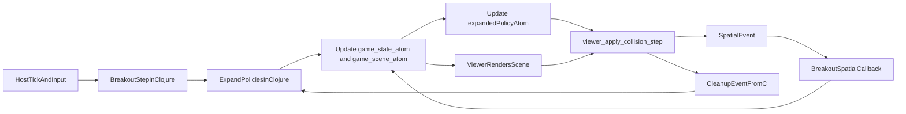

# Breakout auf Collision-Pipeline umstellen

## Zielbild

Breakout nutzt die vorhandene Collision-Pipeline end-to-end, waehrend Clojure die einzige Source of Truth bleibt:

- Die Szene traegt `SpatialRule`-Records in `:collision-rules`.
- Ball, Paddle und Bricks bekommen stabile Prototypen; fuer Bricks wird ein gemeinsamer Brick-Prototyp verwendet.
- Clojure haelt zusaetzlich eine expandierte Policy-Menge mit konkreten Entity-Paaren.
- Die Expansion erfolgt inkrementell nur bei Rule-Aenderungen oder wenn neue relevante Objekte hinzukommen.
- Wegfallende Objekte muessen nicht sofort aus der expandierten Menge entfernt werden; fehlende Entities werden im Viewer zur Laufzeit inert, und bei Bedarf kann die konkrete expandierte Rule zusaetzlich direkt deaktiviert werden.
- Wenn der Viewer viele tote oder deaktivierte konkrete Policies sieht, kann C zusaetzlich ein diskretes Maintenance-Event an Clojure werfen, damit die expandierte Policy-Menge gezielt gefiltert oder neu kompiliert wird.
- `viewer_apply_collision_step()` arbeitet nur noch auf expandierten Policies und erzeugt daraus `SpatialEvent`s.
- Der Clojure-`spatial-callback` reagiert auf `:ball-vs-paddle` und `:ball-vs-brick` und aktualisiert State/Scene.
- `game_state_atom` und `game_scene_atom` bleiben autoritativ und werden nicht in einen langlebigen nativen Gameplay-State ueberfuehrt.
- Die native Seite uebernimmt nur Tick, Snapshot/Render, Collision-Detection auf konkreten Policies und die Zustellung diskreter Events an Clojure.

## Relevante Stellen

- [libs/tiny-breakout/scene.clj](libs/tiny-breakout/scene.clj): baut aktuell `->Group`-Root und setzt `:collision-rules nil`; das muss auf collision-faehige Entities mit Prototypen umgestellt werden.
- [libs/tiny-clj/deployment.clj](libs/tiny-clj/deployment.clj): `breakout-host-spatial-callback!` ist aktuell ein No-op; hier muss die echte Breakout-Collision-Dispatch-Schicht entstehen.
- [src/game_demo_minifb.c](src/game_demo_minifb.c): nutzt noch direkte `viewer_breakout_rect_overlap(...)`-Checks, haelt eine eigene Breakout-Runtime als Gameplay-Quelle und expandiert Rules selbst; das passt nicht zum neuen Modell.
- [src/viewer_collision.c](src/viewer_collision.c): bestaetigt, dass Prototyp-Selektoren per struktureller Gleichheit funktionieren; darauf kann der Brick-Prototyp aufbauen.

## Kritische Architekturpunkte

1. Breakout muss dieselbe Root-Form benutzen, die der Collision-Loader erwartet.
  Heute ist die Breakout-Szene ein `Group`-Baum, der Collision-Loader expandiert Regeln aber ueber eine Entity-Map in `FrameScene.root`. Deshalb muss die Breakout-Szene auf ein entity-map-basiertes Root umgestellt werden, sowohl im Clojure-Build als auch im nativen Breakout-Szenebuilder.
2. Die Policy-Expansion soll in Clojure stattfinden, nicht im Viewer.
  Wegen Ownership, Memory-Macros und globalem Autorelease-Pool ist es einfacher, deklarative Regeln in Clojure mit `CljTransientVector` in konkrete Policies zu expandieren und dem Viewer direkt die expandierte Menge zu geben.
3. Die Expansion soll inkrementell und bewusst simpel bleiben.
  Es sind weniger als 20 deklarative Regeln zu erwarten. Deshalb ist im ersten Wurf kein zusaetzlicher Index noetig; bei neuen Objekten reicht ein linearer Scan ueber alle Regeln und das Anhängen der betroffenen konkreten Policies.
4. Der native Breakout-Sonderpfad muss seine Gameplay-Autoritaet verlieren.
  Der aktuelle Pfad kopiert den State einmal aus `game_state_atom`, leert das Atom danach und fuehrt Ball/Paddle/Brick-Logik in C weiter. Fuer Clojure als Source of Truth darf dieser Besitzwechsel nicht mehr stattfinden; der Host darf nur noch diskrete Inputs und Spatial-Events an Clojure liefern und die daraus publizierte Szene anzeigen.

## Umsetzungsschritte

1. Collision-faehige Breakout-Szene definieren.
  In [libs/tiny-breakout/scene.clj](libs/tiny-breakout/scene.clj) stabile Prototypen fuer `ball`, `paddle` und `brick` einfuehren, das Root auf eine Entity-Map umstellen und deklarative `SpatialRule`-Records fuer `:ball-vs-paddle` und `:ball-vs-brick` definieren.
2. Inkrementelle Policy-Expansion in Clojure einfuehren.
  In den betroffenen Breakout-/tiny-fx-Namespaces eine expandierte Runtime-Form aufbauen, die deklarative Regeln mit `CljTransientVector` in konkrete Policies ueberfuehrt. Dabei nur bei Rule-Aenderungen oder neuen Objekten anhaengen; bei Objektentfall bleiben alte Policies vorerst bestehen, werden entweder inert oder bei Bedarf per Record-Mutation direkt deaktiviert und erst spaeter optional kompaktierte.
3. Breakout-Hostpfad auf atom-getriebenen Betrieb umbauen.
  In [src/game_demo_minifb.c](src/game_demo_minifb.c) den nativen Breakout-Sonderpfad so reduzieren, dass er nicht mehr selbst Ball/Paddle/Brick-State besitzt oder Rules expandiert. Stattdessen soll der Host diskrete Button-Ereignisse und Spatial-Events an Clojure zustellen, die jeweils aktuelle Szene aus `game_scene_atom` rendern und konkrete Policies aus einer expandierten Datenstruktur konsumieren.
4. Breakout-Collision-Callback in Clojure verdrahten.
  In [libs/tiny-clj/deployment.clj](libs/tiny-clj/deployment.clj) den Breakout-`spatial-callback` von No-op auf den generischen Dispatcher umstellen und Breakout-spezifische Watcher/Handler registrieren, die aus `SpatialEvent`s deterministisch `ball bounce`, `brick removal`, `score`, `phase` und ggf. `level clear` ableiten.
5. Maintenance-Event fuer Policy-Cleanup vorsehen.
  In [src/game_demo_minifb.c](src/game_demo_minifb.c) und [libs/tiny-clj/deployment.clj](libs/tiny-clj/deployment.clj) einen schmalen Pfad vorsehen, ueber den C bei Bedarf ein diskretes Event an Clojure wirft, wenn expandierte Policies gefiltert, deaktivierte Eintraege bereinigt oder konkret neu aufgebaut werden sollen.
6. Clojure-Step fuer Host-Ticks sauber definieren.
  In [libs/tiny-clj/deployment.clj](libs/tiny-clj/deployment.clj) und den betroffenen Breakout-Namespaces einen klaren Tick-/Input-/Collision-/Maintenance-Updatepfad bauen, so dass `step-state`, Policy-Pflege und Szenenaufbau in Clojure bleiben und der Host nur noch diskrete Ereignisse liefert. Dabei muessen Paddle-/Brick-Kollisionen aus dem nativen Sonderpfad entfernt werden.
7. Regressionstests vor/nach der Umstellung absichern.
  Tests fuer Root-Shape, Prototypen, deklarative Rules, inkrementelle Expansion bei neuen Objekten, lazy Objektentfall bzw. Rule-Deaktivierung per Record-Mutation, Cleanup per Event aus C, callback-getriebene Brick-Entfernung, Clojure als autoritative State-Quelle und das Fehlen der alten manuellen Kollision in [src/tests/test_breakout_contract.c](src/tests/test_breakout_contract.c), [src/tests/test_breakout_runtime_startup.c](src/tests/test_breakout_runtime_startup.c) und ggf. [src/tests/test_gfx_collision_contract.c](src/tests/test_gfx_collision_contract.c) ergaenzen.
8. Verifikation.
  Relevante Unit-Tests plus Breakout-Start auf dem Host ausfuehren und gezielt pruefen, dass Ball/Paddle/Brick jetzt ueber `SpatialEvent`s und Clojure-State reagieren, neue Bricks nur inkrementell Policies anhaengen, entfernte Bricks keine Kollisionen mehr feuern und keine native Zweitquelle mehr vorhanden ist.

## Besondere Risiken

- Snapshot-basierte Collision-Events koennen ein Frame spaeter kommen als die bisherige direkte Physics-Pruefung; das muss in den Bounce-Regeln und Tests explizit abgesichert werden.
- Wenn der Host noch irgendwo einen eigenen Brick-/Ball-Cache behaelt, drohen Ghost-Collisions oder doppelte Hits; die Umstellung muss solche nativen Zweitquellen vollstaendig entfernen oder strikt auf Render-Caches begrenzen.
- Die append-only Expansion braucht eine Duplikat-Sicherung, damit neu erscheinende Objekte konkrete Policies nicht mehrfach anhaengen.
- Lazy Removal darf nicht zu dauerhaft wachsenden Policy-Mengen fuehren; falls konkrete Policies bei Objektentfall per Record-Mutation deaktiviert werden, muss diese Mutation eindeutig und testbar sein. Eine spaetere opportunistische Kompaktierung sollte als Folgeschritt moeglich bleiben, aber nicht Teil des ersten Wurfs sein.
- Ein Maintenance-Event aus C darf nicht im Hot-Path spammen; es braucht eine klare Trigger-Bedingung oder Entprellung, damit Cleanup/Filtern nur bei echtem Bedarf angestossen wird.
- Die Umstellung auf entity-map-Root darf Render-Reihenfolge und Sichtbarkeit der bestehenden Breakout-Szene nicht veraendern.
