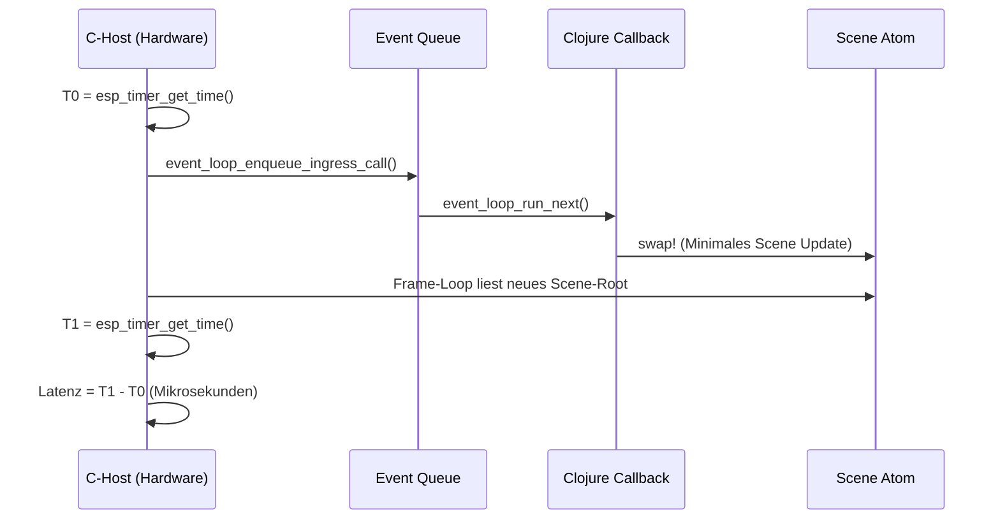

# Messung der Collision Roundtrip-Latenz auf dem ESP32

Um die genaue Zeit zu messen, die ein Kollisions-Event vom Auslösen im C-Code über die Event-Queue, die Clojure-Verarbeitung (`swap!`) und zurück bis zum erneuten Einlesen der Szene durch den C-Renderer benötigt, müssen wir eine dedizierte Profiling-Sonde in den ESP32-Build einbauen. 

Der Test wird exakt den gleichen Pfad nehmen, den das Spiel nimmt.

## Architektur der Messung



## Umsetzungsschritte

### 1. C-seitige Instrumentierung (`esp32-idf/main/tinyclj_idf_run.c` oder Display-Loop)
Da der ESP32 den Render-Loop ausführt (oder in Zukunft ausführen wird), injizieren wir dort eine Messlogik:
*   Füge eine globale Variable `uint64_t g_debug_collision_start_us = 0;` hinzu.
*   Erstelle eine neue C-Funktion (z.B. `debug_trigger_collision_test()`), die als Clojure-Builtin exportiert wird. Diese Funktion:
    1. Setzt `g_debug_collision_start_us = esp_timer_get_time()`.
    2. Pusht sofort ein künstliches Collision-Event über `event_loop_enqueue_ingress_call` in die Queue.

### 2. Messpunkt beim Scene-Update einbauen
Dort, wo der C-Host das aktualisierte Atom ausliest (normalerweise im Render-Loop oder beim Entpacken der neuen `FrameScene`), fangen wir das Ende der Roundtrip-Zeit ab:
*   Wir hängen uns an die Funktion, die das Scene-Root nach Änderungen scannt (z.B. nach dem Auslesen des Atoms im C-Loop).
*   Wenn `g_debug_collision_start_us > 0` ist und eine neue Szenen-ID oder ein Flag erkannt wurde:
    1. `uint64_t end_us = esp_timer_get_time();`
    2. Ausgabe über UART: `printf("Roundtrip: %llu us\n", end_us - g_debug_collision_start_us);`
    3. Setze `g_debug_collision_start_us = 0;` (Warten auf nächsten Test).

### 3. Clojure-seitiges Setup für den Test
In einem kleinen Skript (z.B. `test-latency.clj`), das auf den ESP32 geladen wird:
*   Wir binden per `tiny-fx.gfx-collision/set-collision-callback!` einen extrem simplen Callback an. Dieser simuliert die Reaktion des Spiels (z.B. einen Sprite verschieben oder ein Scale-Flag umschalten), damit das Atom wirklich mutiert wird und der C-Renderer die Änderung anfordert.
*   Eine Schleife triggert die C-Funktion `debug_trigger_collision_test()` z.B. 100 Mal mit kurzen Pausen (z.B. `platform_sleep_ms(50)` via Event-Loop).

### 4. Ausführung auf der echten Hardware
*   Das Skript wird via `tiny-clj-repl` an den ESP32 gesendet.
*   Auf dem UART-Monitor sieht man dann die reinen Hardware-Messwerte in Mikrosekunden:
    ```text
    Roundtrip: 1250 us
    Roundtrip: 1180 us
    ...
    ```

Dieser Test zeigt exakt, ob Clojures Event-Queue plus Garbage Collection und Scene-Generation (`update-nodes` etc.) schnell genug für das 60-FPS-Ziel (< 16,6 ms) ist oder ob wir das "Arcade Physics"-Offloading zwingend für flüssiges Gameplay in Breakout benötigen.