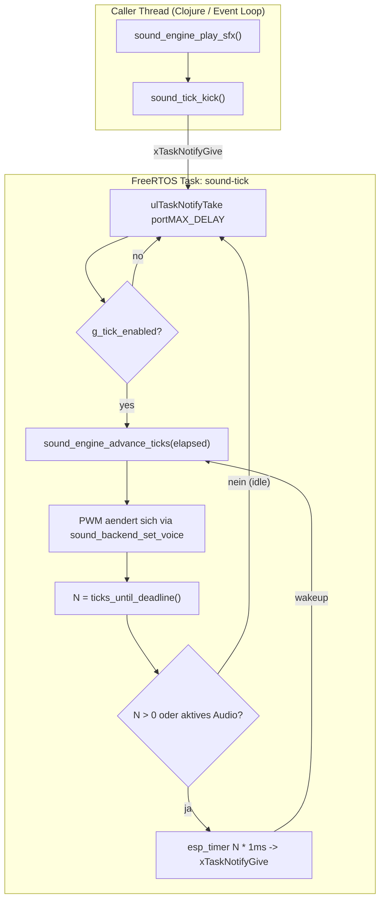

# ESP32 RTOS Sound Thread

## Overview

Ersetzt den esp_timer-Callback im ESP32-Sound-Backend durch einen dedizierten FreeRTOS-Task mit event-basiertem Scheduling -- der Task schlaeft bis zur naechsten PWM-Aenderung statt jeden Tick aufzuwachen.

## Todos

- [ ] ESP32 sound_backend_esp32.c: esp_timer-Callback durch FreeRTOS Task + event-basiertes Scheduling ersetzen
- [ ] Host-Build + vollstaendige Unit-Tests (1931+ Tests, 0 Failures)
- [ ] Sourcecode aufraeumen -- tote Codepfade, ueberfluessige Kommentare entfernen

## Motivation

Das aktuelle ESP32-Backend nutzt `esp_timer` one-shot callbacks mit `sound_engine_advance_ticks(due)` (Batch-Processing) und wacht jeden Tick (1ms) auf. Die LEDC-PWM-Hardware haelt Frequenz und Duty aber selbststaendig aufrecht -- der Task muss nur aufwachen, wenn sich der PWM-Output aendert. `sound_engine_ticks_until_deadline()` liefert exakt die Anzahl Ticks bis zur naechsten Aenderung (Gate-Expiry, Stream-Event, Envelope-Stage). Dadurch kann der Task event-basiert schlafen statt per-tick zu ticken.

**Beispiel: 30ms Beep bei 880 Hz**
- Wakeup 1: Kick → Note-On → PWM 880 Hz. `ticks_until_deadline()` = 30 → 30ms schlafen
- Wakeup 2: Timer → Gate abgelaufen → PWM 0. Kein aktives Audio → tief schlafen
- **2 Wakeups statt 30**

## Architektur

## Aenderungen in `src/sound_backend_esp32.c`

### Entfernen

- `g_sound_tick_in_callback`, `g_sound_scheduled_ticks`
- `sound_timer_callback()`, `sound_backend_schedule_next_timer()`, `sound_backend_ticks_to_delay_us()`
- `SOUND_TICK_BUDGET_US`

### Neu hinzufuegen

- **FreeRTOS Includes**: `freertos/FreeRTOS.h`, `freertos/task.h`
- **Thread-State**:
  - `static TaskHandle_t g_sound_task = NULL;`
  - `static _Atomic bool g_tick_task_running = false;`
  - `static _Atomic bool g_tick_enabled = false;`
  - `static int64_t g_last_wakeup_us = 0;` (Zeitstempel des letzten Aufwachens)
- **Monotone Zeit**: `esp_timer_get_time()` liefert Mikrosekunden direkt
- **Praeziser Sleep** (`esp32_sound_sleep_us`): Nutzt `esp_timer` (`g_sleep_timer`) one-shot als Wecker. Timer-Callback ruft `xTaskNotifyGive(g_sound_task)`. Task blockiert auf `ulTaskNotifyTake(pdTRUE, portMAX_DELAY)`. Kein Busy-Wait, kein FreeRTOS-Tick-Jitter, Mikrosekunden-Aufloesung. Timer wird einmal in `sound_backend_init` erstellt und wiederverwendet.
  - Vorzeitiges Aufwecken (durch `sound_tick_kick` -> `xTaskNotifyGive`) jederzeit moeglich.
- **Task-Main** (`esp32_tick_task_main`):
  1. `while (g_tick_task_running)`:
  2. Wenn `!g_tick_enabled`: `ulTaskNotifyTake(portMAX_DELAY)` → tiefer Schlaf bis Kick, continue
  3. `now = esp_timer_get_time()`, `elapsed_us = now - g_last_wakeup_us`
  4. `elapsed_ticks = elapsed_us / (VG_SOUND_TICK_MS * 1000)` (ganzzahlig, abgerundet)
  5. Wenn `elapsed_ticks > 0`: `sound_engine_advance_ticks(elapsed_ticks)`, `g_last_wakeup_us += elapsed_ticks * VG_SOUND_TICK_MS * 1000` (exakte Buchhaltung, kein Drift)
  6. `N = sound_engine_ticks_until_deadline()`
  7. Wenn `N == 0` und kein aktives Audio: `sound_tick_sleep()` → setzt `g_tick_enabled = false`, continue (→ tiefer Schlaf)
  8. `esp32_sound_sleep_us(N * VG_SOUND_TICK_MS * 1000)` → schlaeft exakt bis zur naechsten PWM-Aenderung

**Kein `SoundTickScheduler` noetig** -- die Zeitbuchhaltung ist trivial (Differenz `esp_timer_get_time` zu `g_last_wakeup_us`), und das Deadline-basierte Schlafen ersetzt den Scheduler komplett.

### Angepasste Funktionen

- **`sound_backend_init`**: Task mit `xTaskCreatePinnedToCore` erstellen (Stack 4096, Prio `configMAX_PRIORITIES - 2`, Core 1), `g_tick_task_running = true`
- **`sound_backend_shutdown`**: `g_tick_task_running = false`, `xTaskNotifyGive` zum Aufwecken, `vTaskDelay(pdMS_TO_TICKS(50))` als Join-Ersatz, dann `vTaskDelete`
- **`sound_tick_start`**: `sound_engine_tick_mark_running()`, `g_last_wakeup_us = esp_timer_get_time()`, `g_tick_enabled = true`, `xTaskNotifyGive`
- **`sound_tick_stop`**: `g_tick_enabled = false`, `sound_engine_tick_mark_stopped()`, Voices silencen
- **`sound_tick_sleep`**: `g_tick_enabled = false` (nur Flag -- Task schlaeft beim naechsten Loop)
- **`sound_tick_kick`**: Wenn `!tick_is_running()`: `sound_tick_start()`. Sonst: `g_tick_enabled = true`, `xTaskNotifyGive`
- **`sound_backend_host_get_status`**: `tick_thread_running` aus `g_tick_task_running` fuellen

## Nicht geaendert

- PWM-Voice-Logik (`PwmVoice`, `sound_backend_set_voice`, Silence-Helper) bleibt identisch
- `sound_backend_keepalive_active` bleibt `return false`
- Host-Backend und Test-Runner-Pfade bleiben unberuehrt

## Risiken / Entscheidungen

- **Stack-Size**: 4096 Bytes sollte reichen (kein Alloc, keine VM-Calls im Tick-Pfad); bei Bedarf anpassen
- **Task-Prioritaet**: `configMAX_PRIORITIES - 2` (eine unter hoechster) stellt sicher, dass Sound nicht von niederpriorisierten Tasks verzoegert wird
- **Core-Pinning**: Core 1 vermeidet Konkurrenz mit WiFi/BT auf Core 0
- **Timing-Praezision**: `esp_timer` hat Mikrosekunden-Aufloesung; kein `vTaskDelay`-Jitter
- **CPU-Effizienz**: Task schlaeft zwischen PWM-Aenderungen (event-basiert statt per-tick). Ein 30ms-Beep verursacht 2 Wakeups statt 30
