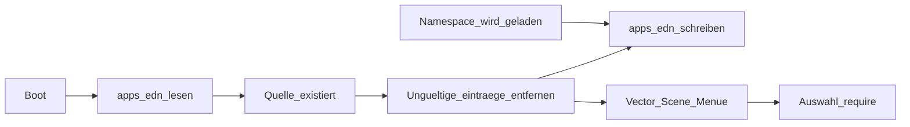

# Grafisches Boot-Menü (`apps.edn`)

## Installation (Begriff im Plan)

Unter **Installation** einer App ist hier **kein** separater Installer gemeint, sondern:

1. **Kopieren** der zugehörigen Namespace-Quellen (`.clj` und ggf. Assets) auf das **tiny-clj.fs-Image** bzw. in die erwarteten `/libs/...`-Pfade (Deployment wie bei anderen Bibliotheken).
2. **Einmaliges manuelles Laden** des Namespaces (z. B. `(require '…)` im REPL oder ein kurzer Boot-Schnipsel), damit die **Selbstregistrierung** in `apps.edn` ausgeführt wird und der Eintrag erscheint/aktualisiert wird.

Spätere Boots: fehlt die `.clj`, wird der Eintrag **beim Menü-Aufbau automatisch aus `apps.edn` gelöscht**; ein erneutes manuelles Laden ist für die reine Listenführung nicht nötig.

## Zielbild

- Nach dem Start (oder vor dem REPL) zeigt die Runtime eine **grafische Liste** der in **`apps.edn`** eingetragenen Apps.
- **macOS (`game-demo`):** Beim **Start der App** erscheint zuerst das Menü (kein versteckter „Demo-Direktstart“ ohne Menü, außer explizit anders konfiguriert). Der **markierte** Listenpunkt **pulsiert** (sichtbare Animation, z. B. Alpha/Skalierung oder Stroke über bestehende Timeline/AnimState-Mechanik in tiny-fx).
- **Pflege des Manifests:** Sobald ein **Namespace geladen** wird, **trägt er sich in `apps.edn` ein** oder **aktualisiert** seinen bestehenden Eintrag (Titel, Reihenfolge-Hinweis, optional `:source-path`, Zeitstempel – je nach Schema). So entsteht die App-Liste **organisch** aus tatsächlich geladenen Modulen, ohne große Datei manuell zu pflegen.
- **Menü vor der Darstellung:** `apps.edn` lesen und pro Eintrag prüfen, ob die App **noch ladbar** ist (erwarteter Clojure-Pfad: gespeichertes `:source-path` oder aus `:ns` → `/libs/.../....clj` abgeleitet). Prüfung per `resolve_path_to_bytes` / `tiny-clj.fs/stat`. **Kein** `(require ...)` der Kandidaten nur fürs Menü. **Fehlen die Quelldateien**, Eintrag **automatisch aus `apps.edn` entfernen** (persistiert mit `spit-bytes`, nur bei geändertem Inhalt / Diff wie bei `register-app!`).
- Nach **Auswahl** im Menü: gezieltes `(require ...)` / Entry-Aufruf.

## Datei `apps.edn` (Manifest)

**Pfad:** z. B. `/boot/apps.edn` auf dem `tiny-clj.fs`-Image (ein Ort, keine Duplikate).

**Bootstrap:** Beim ersten Start kann eine **leere Liste** `[]` oder ein **Seed** aus dem Repo (optional [`libs/tiny-fx/manifest/apps.edn`](libs/tiny-fx/manifest/apps.edn)) ins Image; danach dominiert der **laufzeitaktualisierte** Inhalt.

**Minimalfelder pro Eintrag** (vom Namespace bei Registrierung gesetzt/aktualisiert):

- `:id` – stabiler Keyword (z. B. `:game-demo`)
- `:title` – **Anzeigename** (String)
- `:ns` – Symbol für `(require '...)`
- `:source-path` – String `"/libs/.../....clj"` – **Pflicht für zuverlässige Validierung**; beim Selbstregistrieren aus der tatsächlichen Load-Quelle setzen (wenn bekannt), sonst aus `namespace-to-relpath`-Konvention ableiten (gleiche Logik wie in [`builtins.c`](src/builtins.c) / `namespace_to_relpath`)

Optional: `:description`, `:order`, `:hidden`, `:registered-at`, `:min-tiny-clj-version`.

**Parser:** `read-string` / EDN; Dateigröße begrenzen (Tests).

## Selbstregistrierung beim Namespace-Load

- **Konvention:** Jeder „App“-Namespace ruft beim Laden **einmalig** eine kleine API auf, z. B. `tiny-fx.boot-menu/register-this-app! {:title "..."}` oder expliziter Aufruf am Ende der `ns`-Form.
- **Alternative (später):** Hook in `require`/`load-namespace` – höher invasiv.
- **Idempotenz:** Merge nach `:id` oder `:ns`; bestehenden Eintrag aktualisieren, keine Duplikate.
- **ESP32 / Flash:** Schreiben nur bei **echter Änderung** (EDN-Vergleich vor `spit-bytes`).

## Clojure-Modul (gemeinsam ESP32 + Host-Sim)

Neues Namespace-Modul (z. B. `tiny-fx.boot-menu` unter [`libs/tiny-fx/`](libs/tiny-fx/)):

- `load-apps` – `slurp-bytes` auf `/boot/apps.edn` + EDN parse → Liste von Maps
- `validate-and-sync-apps!` – pro Eintrag prüfen, ob die **Clojure-Datei** existiert; ungültige Einträge streichen und **`apps.edn` neu schreiben** bei Änderung. Nur verbleibende Einträge an die UI; **kein** `require` für diese Prüfung
- `register-app!` / `upsert-app!` – Merge in `apps.edn` (lesen, mergen, nur bei Änderung schreiben)
- `entries-for-ui` – sortiert, `:hidden` respektieren; **Selektionsindex** und **Animations-Hints** für den Fokus-Eintrag (Pulsieren)

**UI-Schicht (tiny-fx):** aus der **validierten** Liste **Scene-Daten** erzeugen (`VText`, Selection, …). **Fokus:** gewählter Eintrag **pulsiert** (Timeline/AnimState, konsistent mit Vector-Scene).

**Reihenfolge:** Zuerst **Validierung + ggf. Bereinigung von `apps.edn`** → dann `entries-for-ui`; niemals `require` aller Apps nur für das Menü.

**Eingabe:** ESP32: Buttons/Encoder/GPIO; macOS: Tastatur/Pfeile im `game-demo`-Pfad.

## macOS tiny-fx App (`game-demo`)

- **Startverhalten:** Boot-Menü **sofort** nach Renderer/Window-Setup: `apps.edn` laden → **Validierung + Bereinigung** → Szene. Nach **Bestätigung** (z. B. Enter): gewählte App laden (`require` / Entry).
- **Auswahl-Animation:** aktuell ausgewählter Punkt **pulsiert** (Timeline/Keyframe/AnimState; kein Clojure-Busy-Loop im Hot-Path).
- Technisch: Target [`game-demo`](../CMakeLists.txt) ([`src/game_demo_minifb.c`](../src/game_demo_minifb.c), ggf. [`src/game_demo_macos_menu.m`](../src/game_demo_macos_menu.m)) – Einstieg zuerst `tiny-fx.boot-menu`-Szene.
- **Parität:** gleiche `apps.edn`-Semantik wie auf dem Gerät; Eingabe nur unterschiedlich.

## ESP32-Integration

- Optional in [`esp32-idf/main/tinyclj_idf_run.c`](../esp32-idf/main/tinyclj_idf_run.c): Menü vor REPL; nach Auswahl `(require ...)` / Entry (`-main` oder `:entry` im Manifest).
- Verhältnis zu `/boot/root.edn`: Manifest-first dokumentieren; `root.edn` optional für Power-User.

## Embedded-Sources / Flash-FS

- Manifest in [`cmake/embedded_clojure_sources.cmake`](../cmake/embedded_clojure_sources.cmake) registrieren falls nötig.
- Deployment: mit [Plans/edn-assets-on-demand-test-first-plan.md](edn-assets-on-demand-test-first-plan.md) abstimmen.

## Vorgehen: test-first und schrittweise

**Regel:** Pro Phase zuerst **rote Tests**, dann **minimale Implementierung**, dann **Regression**, dann nächste Phase.

**Abbruchkriterium:** Neue Tests grün + keine Regression in den vereinbarten Gruppen.

### Phase 1 – Schema und Parsing (ohne FS)

- Tests: gültige/minimale `apps.edn`; ungültige EDN → Fehler; `[]`; Normalisierung.
- Implementierung: `tiny-fx.boot-menu` mit reinen Funktionen auf String/Byte-Content.
- Gate: Phase-1-Tests grün.

### Phase 2 – Validierung „ladbar“ + Manifest bereinigen (mit FS, ohne `require`)

- Tests: KV wie in [`src/tests/test_file_io.c`](../src/tests/test_file_io.c); zwei Einträge, eine `.clj` löschen → **`apps.edn` persistent** nur noch gültiger Eintrag; Grenzfall `[]`.
- Implementierung: Existenzcheck; gefilterte Liste; bei Änderung `spit-bytes` auf `/boot/apps.edn` (Diff vor Schreiben).
- **Optional später:** `require` scheitert aus anderen Gründen (Syntax, deps) → zweite Bereinigungsstelle; v1 = **fehlende Dateien**.
- Gate: Phase-2-Tests grün + FS-Regression.

### Phase 3 – Selbstregistrierung / Upsert

- Tests: `register-app!`; Update gleicher `:id`; kein Duplikat; kein Schreiben bei identischem EDN.
- Implementierung: Merge nach `:ns`/`:id`, `spit-bytes`.
- Gate: Phase-3-Tests grün.

### Phase 4 – Menü-Daten für die UI

- Tests: deterministische Struktur (`:line`, `:selected-index`, `:focus-pulse-spec`, …).
- Gate: Phase-4-Tests grün.

### Phase 5 – macOS `game-demo`: Menü beim Start + Puls

- Implementierung: Einstieg → Menü; Navigation; Puls auf Fokus; Bestätigung → `require`/Entry.
- Tests/Smoke: Daten-Tests wo möglich; Puls ggf. manuell dokumentiert.
- Gate: vereinbarte Tests grün.

### Phase 6 – ESP32 Boot

- Tests: gleiche Clojure-API wo möglich; Hardware-Checkliste.
- Gate: dokumentiert + Smoke.

### Phase 7 – Embed / Deploy

- Image-Pipeline, Doku.
- Gate: Build + Image-Test falls vorhanden.

### Abschluss

- Todo **cleanup** (siehe todos).

## Risiken / Nicht-Ziele

- **Anzeigetext:** aus Registrierung / `:title`, nicht aus `.clj`-Kopf-Heuristik.
- **Stale Einträge:** bei fehlender Datei **automatisch aus `apps.edn` entfernen**; Schreibzugriff durch Diff-Policy begrenzen.
- **Schreiblast:** `register-app!` + Bereinigung – Diff vor jedem Schreiben.
- Vollscan `/libs/` als einzige Quelle: out-of-scope für v1.

## Abhängigkeiten

- [`libs/tiny-clj/fs.clj`](../libs/tiny-clj/fs.clj), [`src/source_resolver.c`](../src/source_resolver.c), tiny-fx Renderer/Scene.
