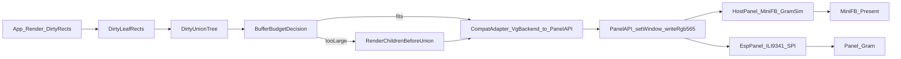

# Gemeinsame Panel-API fuer Host und ESP (test-first, schrittweise)

## Arbeitsweise

- Die Implementierung erfolgt in einem eigenen Feature-Branch.
- Der Feature-Branch wird vor Beginn der eigentlichen Umsetzung angelegt und dient als isolierter Integrationspfad fuer die test-first Migration.

## Startreihenfolge

1. Eigenen Feature-Branch fuer die Implementierung anlegen.
2. Bestehende Baseline-Tests ausfuehren und dokumentieren.
3. Erste Kontrakt-Tests fuer die gemeinsame Panel-API anlegen.
4. Erst danach mit der eigentlichen Implementierung beginnen.

## Ziel

- Eine gemeinsame, controller-agnostische Display-Schnittstelle fuer Host und ESP bereitstellen.
- Jede Migrationsphase mit Tests absichern, bevor die naechste Phase startet.
- Alte API erst nach nachgewiesener Vollmigration entfernen.
- Benoetigten SPI-Durchsatz waehrend der Umstellung messbar machen und entlang realer Frame-/Flush-Daten optimieren.
- Compositing-korrektes Dirty-Rect-Rendering mit dynamisch wachsendem Redraw-Buffer bis zu einer Obergrenze von ca. 20 kB sicherstellen und fuer Buffer-, Cluster- und Flush-Kosten optimieren.
- Die konfigurierte Maximalgroesse des Redraw-Buffers darf nicht unter der Groesse liegen, die fuer eine Textzeile ueber die volle Slot-Breite in einem einzelnen Render-/Flush-Pass noetig ist.

## Relevante Dateien

- Host-Flush und Viewer-Pfad: [`/Users/theisen/Projects/tiny-clj/src/game_demo_minifb.c`](/Users/theisen/Projects/tiny-clj/src/game_demo_minifb.c)
- Aktuelle Backend-Grenze: [`/Users/theisen/Projects/tiny-clj/src/render_backend.h`](/Users/theisen/Projects/tiny-clj/src/render_backend.h)
- Framebuffer/Primitives: [`/Users/theisen/Projects/tiny-clj/src/vector_scene_graph.h`](/Users/theisen/Projects/tiny-clj/src/vector_scene_graph.h), [`/Users/theisen/Projects/tiny-clj/src/gfx.h`](/Users/theisen/Projects/tiny-clj/src/gfx.h)
- Host-Helfer: [`/Users/theisen/Projects/tiny-clj/src/viewer_host_runloop.h`](/Users/theisen/Projects/tiny-clj/src/viewer_host_runloop.h), [`/Users/theisen/Projects/tiny-clj/src/viewer_host_slots.h`](/Users/theisen/Projects/tiny-clj/src/viewer_host_slots.h), [`/Users/theisen/Projects/tiny-clj/src/viewer_host_spatial.h`](/Users/theisen/Projects/tiny-clj/src/viewer_host_spatial.h)
- Testbasis: [`/Users/theisen/Projects/tiny-clj/src/tests/test_vector_scene_graph.c`](/Users/theisen/Projects/tiny-clj/src/tests/test_vector_scene_graph.c), [`/Users/theisen/Projects/tiny-clj/src/tests/test_breakout_contract.c`](/Users/theisen/Projects/tiny-clj/src/tests/test_breakout_contract.c), [`/Users/theisen/Projects/tiny-clj/src/tests/test_breakout_runtime_startup.c`](/Users/theisen/Projects/tiny-clj/src/tests/test_breakout_runtime_startup.c)

## Minimale gemeinsame Panel-API

- Ziel ist keine Primitive-Library (`draw_line`, `fill_rect`, `draw_text`), sondern eine panel-nahe Display-Schnittstelle.
- Die minimale API soll sich eng an `esp_lcd` orientieren und sowohl auf ESP als auch auf den Host abbildbar sein:
  - `panel_reset()`
  - `panel_init()`
  - `panel_set_orientation(mirror_x, mirror_y, swap_xy)`
  - `panel_set_gap(x_gap, y_gap)` optional, falls das konkrete Panel dies benoetigt
  - `panel_write_bitmap(x_start, y_start, x_end, y_end, rgb565_pixels)`
  - `panel_write_bitmap_2d(x_start, y_start, x_end, y_end, src_pixels, src_w, src_h, src_x_start, src_y_start, src_x_end, src_y_end)` optional fuer Quell-Bitmaps mit Ausschnitt
  - `panel_set_display_enabled(on_off)`
  - `panel_set_sleep(sleep)` optional
- Rohes Controller-I/O (`tx_param`, `tx_color`) bleibt eine untere Escape-Hatch fuer herstellerspezifische ILI9341/Panel-Kommandos, gehoert aber nicht zur normalen App-Grenze.
- Rendering-Primitive bleiben oberhalb dieser Schicht in der bestehenden Renderer-/Dirty-Rect-Logik.
- Die App soll gegen die gemeinsame Panel-API arbeiten; die ESP-Implementierung mappt auf `esp_lcd_panel_*`, der Host auf GRAM-/Fenster-Simulation.

## Schrittweises Vorgehen mit Gates

1. Baseline sichern
- Bestehende relevante Tests laufen lassen und als Referenz festhalten.
- Gate: Baseline ist gruen und reproduzierbar.

2. Panel-API Kontrakt test-first
- Zuerst Tests fuer API-Semantik schreiben (`reset`, `init`, Orientierung, `write_bitmap`, optional `write_bitmap_2d`, Fehlerfaelle, Reihenfolgekontrakte).
- Danach minimale API-Struktur implementieren, bis die neuen Tests gruen sind.
- Gate: Panel-API-Kontrakt ist stabil, direkt auf `esp_lcd` abbildbar und getestet, aber noch ohne Massenmigration.

3. Kompatibilitaets-Layer test-first
- Erst Adapter-Tests erstellen: Dirty-Rect aus `VgBackendOps.submit_rect` muss korrekt in Panel-Operationen ueberfuehrt werden.
- Danach Adapter implementieren und in bestehendem Flow einschleifen.
- Gate: Bestehende Aufrufer laufen unveraendert, neue Adapter-Tests und alte Regressionstests sind gruen.

4. Host-Migration test-first
- Vor Migration Host-Tests um GRAM-Konsistenz, Update-Reihenfolge und Integrationsgrenzen erweitern.
- Dann Host-Implementierung auf Panel-API umstellen.
- Gate: Host-Verhalten bleibt funktional identisch (keine Render-Regressionen).

5. ESP-Pfad test-first
- Erst ESP/ILI9341-nahe Tests fuer `esp_lcd`-Mapping definieren (`panel_reset/init`, Orientierung, Bitmap-Flush).
- Dann konkretes ESP-Backend hinter derselben Panel-API implementieren.
- Gate: Shared API laeuft fuer Host und ESP mit denselben Kernkontrakten und bildet sich ohne Sonderfaelle auf `esp_lcd_panel_*` ab.

6. Dirty-Union-Baum test-first
- Erst Tests fuer die neue Redraw-Strategie definieren:
  - ueberlappende Rects werden zu logischen Clustern zusammengefasst
  - ein Union-Knoten wird nur direkt gerendert, wenn seine Flaeche ins Buffer-Budget passt
  - passt die Union nicht, werden die beiden Kinder vor der Union separat gerendert
  - beide Kinder werden mit derselben Objektmenge des logischen Clusters gerendert, aber jeweils geclippt
  - geometrischer Split ist nur Fallback, wenn bereits ein Blatt-Rect nicht ins Budget passt
- Danach Union-Baum und budgetiertes Rendering implementieren.
- Gate: Compositing bleibt korrekt, obwohl physisch in kleinere Renderpaesse zerlegt wird.

7. Durchsatzmessung absichern
- Zuerst Tests fuer Metrik-Erfassung und Ausgabe (Bytes, Transfers, Dauer, MB/s) schreiben.
- Dann Instrumentierung im Transferpfad aktivieren.
- Gate: Durchsatzwerte sind reproduzierbar und zwischen Host/ESP getrennt auswertbar.

8. Buffer-Sweet-Spot absichern
- Messdaten fuer verschiedene Startgroessen, Wachstumsstufen und Spielprofile sammeln.
- Standardkonfiguration und Wachstumsstrategie des Redraw-Buffers anhand von Render-, Cluster- und Flush-Kosten festlegen.
- Sicherstellen, dass die konfigurierte Obergrenze mindestens eine Textzeile ueber die volle Slot-Breite in einem Pass erlaubt.
- Gate: Die gewaehlte Default-Konfiguration ist datenbasiert begruendet und bleibt innerhalb der Obergrenze.

9. Alt-API kontrolliert entfernen
- Schutztests gegen verbliebene Alt-API-Abhaengigkeiten schreiben.
- Danach Kompatibilitaets-Layer und Alt-Signaturen entfernen.
- Gate: Keine produktiven Aufrufer der Alt-API mehr vorhanden, gesamter relevanter Testsatz gruen.

## Renderstrategie unter Buffer-Budget

- Der Redraw-Buffer darf dynamisch wachsen, hat aber eine Obergrenze; der aktuelle Zielkorridor endet bei ca. `20 kB`.
- Der konkrete Sweet Spot fuer Startgroesse und Wachstum wird empirisch bestimmt und kann je Spiel oder Szenenprofil unterschiedlich ausfallen.
- Untere Schranke fuer die Obergrenze: Die konfigurierte Maximalgroesse des Buffers muss gross genug sein, um eine Textzeile ueber die volle Slot-Breite in einem einzelnen Render-/Flush-Pass aufzunehmen.
- Dirty-Rects werden nicht sofort global unioniert, sondern als Blaetter eines Union-Baums behandelt.
- Ein innerer Knoten repraesentiert die Union zweier Kinder nur als logische Compositing-Einheit.
- Renderentscheidung pro Knoten:
  - passt `area(rect) * 2` in die aktuell verfuegbare Buffer-Groesse, darf der Knoten direkt gerendert und geflusht werden
  - passt er nicht, darf der Buffer bis zur konfigurierten Obergrenze wachsen
  - passt der Knoten auch dann nicht, werden die beiden Kinder vor der Union gerendert
- Die Objektmenge gehoert dem logischen Cluster, nicht dem physischen Teil-Rect:
  - beide Kinder verwenden dieselbe Cluster-Objektmenge
  - jedes Kind rendert nur mit eigenem Clip-Rect
- Nur wenn bereits ein Blatt-Rect selbst nicht ins Budget passt, darf geometrisch entlang der laengeren Achse weiter gesplittet werden.
- Ueberlappungsfreiheit ist keine Voraussetzung fuer getrennte Kinder-Renderpaesse; Korrektheit entsteht ueber identische Objektmenge plus Clip.
- Durchsatzoptimierung bleibt nachrangig hinter Compositing-Korrektheit; Doppelflush in Ueberlappungszonen ist zulaessig, solange die Semantik stimmt.
- Buffer-Wachstum, Cluster-Groesse und Flush-Kosten werden gemeinsam beobachtet; ein starrer Einheitswert wird bewusst vermieden.

## Operative Frame-Pipeline

1. Animationen, Timelines und sonstige State-Aenderungen fuer den aktuellen Frame ausfuehren.
2. Alle Draw-Objekte bestimmen, deren sichtbares Ergebnis sich geaendert hat:
- Position, Groesse, Sichtbarkeit, Style/Farbe, Text/Inhalt, Z-Order, hinzugefuegt, entfernt.
3. Fuer jedes geaenderte Objekt alte und neue visuelle Bounds bestimmen:
- `old_aabb`
- `new_aabb`
- erstes Seed-Dirty-Rect = `union(old_aabb, new_aabb)`
4. Ueber den raeumlichen Index alle Objekte finden, die die Seed-Dirty-Rects schneiden und deshalb in denselben Redraw-Clustern beruecksichtigt werden muessen.
5. Aus Seed-Dirty-Rects logische Cluster bilden:
- ueberlappende oder verknuepfte Dirty-Bereiche werden zu einer gemeinsamen Compositing-Einheit
- zu jedem Cluster gehoert eine gemeinsame Objektmenge
6. Pro Cluster einen Union-Baum aufbauen und pro Knoten gegen das Buffer-Budget entscheiden:
- passt die Union, wird sie direkt gerendert
- passt sie nicht, werden die Kinder vor der Union gerendert
- ist bereits ein Blatt zu gross, erfolgt geometrischer Fallback-Split
7. Jedes finale Render-Rect in einen Bitmap-Buffer rendern, dessen Groesse innerhalb der konfigurierten Obergrenze dynamisch wachsen darf:
- immer in korrekter Z-Order
- immer mit der vollstaendigen Objektmenge des logischen Clusters
- jeweils nur gegen das aktuelle Teil-Rect geclippt
8. Das fertige Rect ueber die Panel-API auf Host oder ESP flushen.
9. Pro Frame uebertragene Bandbreite und Transferanzahl messen und fuer Budget-/Performance-Entscheidungen protokollieren.

## Compositing und Hardwaregrenzen

- `esp_lcd` ist eine Panel-/Bitmap-Flush-Abstraktion und bietet selbst kein allgemeines Compositing.
- Ein ILI9341- oder vergleichbarer Display-Controller fuehrt ebenfalls kein freies Layer-Compositing fuer die App aus; er bekommt Pixel fuer Ziel-Fenster.
- Fuer klassische ESP32-/ESP32-S3-Zielpfade ist Compositing daher grundsaetzlich softwareseitig in der Renderlogik zu leisten.
- Nur auf neueren SoCs wie ESP32-P4 gibt es mit PPA Hardwarehilfe fuer Fill/Blend; das aendert aber nicht die Grundarchitektur mit Dirty-Clustern, Z-Order und Buffer-Budget.

## Rolle von Slots

- Slots vereinfachen nicht die innere Dirty-Rect-, Cluster- oder Compositing-Logik eines Slots.
- Ihr Hauptnutzen liegt in:
  - Begrenzung der sichtbaren Display-Flaeche pro Slot
  - Priorisierung zwischen Display-Bereichen bei knappem Transferbudget
  - Scheduling oder Drosselung weniger wichtiger Slots
- Typischerweise bekommt ein `game`-Slot Prioritaet vor Overlay-, HUD- oder Debug-Slots, falls die verfuegbare Bandbreite in einem Frame nicht fuer alle Updates reicht.
- Die eigentliche Redraw-Komplexitaet bleibt innerhalb jedes einzelnen Slots voll erhalten und muss dort unabhaengig korrekt geloest werden.

## Ziel-Datenfluss

## Abnahmekriterien

- Jede Phase beginnt mit neuen/erweiterten Tests und endet erst nach gruenem Lauf.
- Host und ESP nutzen dieselbe Panel-API als gemeinsame Schnittstelle zur Applikation.
- Render-Verhalten bleibt kompatibel (insbesondere Dirty-Rect-Semantik).
- Dirty-Rect-Rendering bleibt bei Ueberlappungen compositing-korrekt und respektiert das Buffer-Budget.
- Die gewaehlte Buffer-Startgroesse und Wachstumsstrategie sind fuer das jeweilige Spielprofil datenbasiert abgestimmt.
- Die konfigurierte Maximalgroesse liegt nicht unter der Groesse, die fuer eine Textzeile ueber die volle Slot-Breite in einem Pass benoetigt wird.
- SPI-Durchsatz ist messbar und dokumentierbar.
- Alt-API ist vollstaendig entfernt.
