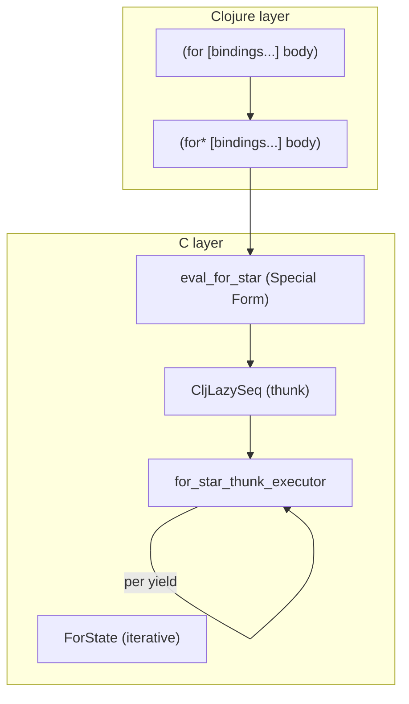

# Iterative `for` as a macro, runtime via `for*` (special form)

## Motivation

`for` in tiny-clj should be **fast** and **low allocation**, while staying source-compatible with Clojure (multiple bindings + modifiers).
Because macroexpansion happens per expression, the macro must remain cheap. Runtime must remain iterative (no recursive `mapcat` / `lazy-seq` user-level implementations).

## Current state (today)

tiny-clj currently implements a basic `for` as a C evaluator (`eval_for`) that returns a `CljLazySeq`. The thunk executor (`native_for_thunk_executor`) carries an internal **state map** with interned symbol keys:

- `__for_seq__`: current sequence/iterator state (cursor into the collection)
- `__for_var__`: binding symbol to bind for the current element
- `__for_body__`: the AST/body to evaluate
- `__for_env_stack__` or `__for_env__`: lexical environment handle

Important correctness detail: **state maps must be passed through the thunk as data (quoted)**. Otherwise the evaluator treats map literals as executable forms and tries to evaluate symbol keys like `__for_seq__`, causing unresolved-symbol errors.

## Core idea (performance-friendly)

Make `for` a macro that **normalizes destructuring at expansion time** and expands to a new internal **special form** `for*`:

### Division of labor

| Phase | Component | Responsibility |
|-------|-----------|----------------|
| Expansion-time | `for` macro | Destructuring normalization (via `gensym` + `:let` injection) |
| Runtime | `for*` special form | Iterative evaluation of bindings, `:when`/`:let`/`:while` modifiers |

### Example: simple case (no destructuring)

```clojure
;; user writes:
(for [x xs :when (pred x)]
  (g x))

;; macro expands to (no change, just head rewrite):
(for* [x xs :when (pred x)]
  (g x))
```

### Example: with destructuring

```clojure
;; user writes:
(for [[a b] pairs :when (even? a) :let [c (* a b)]]
  [a b c])

;; macro expands to (destructuring normalized):
(for* [g__1 pairs :let [a (nth g__1 0 nil) b (nth g__1 1 nil)] :when (even? a) :let [c (* a b)]]
  [a b c])
```

The macro uses existing `clojure.core/destructure` and `gensym` to flatten binding patterns. After expansion, `for*` sees only **symbol bindings** (no destructuring patterns).

### Why `for*` must be a special form

`for*` must be a **special form** so it receives the body as **AST** (no per-element closures) and can evaluate nested collections in the correct lexical environment (Clojure semantics: evaluate later, allow dependencies).

## Architecture



## Implementation plan

### 1. New special form: `for*`

Signature: `(for* [binding-dsl] body)` with a Clojure-typical binding DSL:

- **Bindings**: `sym expr` pairs, any number
- **Modifiers**: `:let [..]`, `:when pred`, `:while pred` (as tokens inside the binding sequence)

Proposed locations:

- `../src/eval.c`: `eval_for_star(...)` + `for_star_thunk_executor(...)`
- `../src/eval.h`: declaration
- `../src/symbol.c` / `../src/symbol.h`: `SYM_FOR_STAR`

### 2. State design (efficient, low allocations)

Avoid:
- building new maps/vectors per step
- building a closure per element

Instead: a compact, RC-managed `ForState` (or minimal: a single persistent `CljMap`) containing:

- `ops`: precomputed binding ops (AST pointers / small C structs)
- `depth`: current binding level
- `iters[]`: per-level iterator/seq object
- `env_stack` or `env` handle (reused; push/pop iteratively)

The thunk should yield **exactly one element per realization** (plus a lazy rest).

### 3. `for` macro (destructuring normalization)

Location: `../src/clojure.core.clj`

Goal: macroexpansion normalizes destructuring so `for*` only sees symbol bindings.

**Macro responsibilities (expansion-time):**

1. Walk the binding vector
2. For each binding pair `[pattern expr]`:
   - If `pattern` is a **symbol**: keep as-is → `sym expr`
   - If `pattern` is **destructuring** (vector/map): replace with `gensym`, inject `:let` with destructure result
3. For each `:let [bindings...]`:
   - Normalize via `(destructure bindings)` to flatten nested destructuring
4. Pass `:when` and `:while` through unchanged
5. Emit `(for* normalized-bindings body)`

**Sketch:**

```clojure
(defn- normalize-for-bindings
  "Normalize bindings: destructuring patterns become gensym + :let injection."
  [bindings]
  (loop [result [] remaining (seq bindings)]
    (if-not remaining
      result
      (let [item (first remaining)]
        (cond
          ;; :when pred
          (= item :when)
          (recur (conj result :when (second remaining))
                 (nnext remaining))
          
          ;; :while pred
          (= item :while)
          (recur (conj result :while (second remaining))
                 (nnext remaining))
          
          ;; :let [bindings]
          (= item :let)
          (let [let-bindings (second remaining)
                flat-bindings (destructure let-bindings)]
            (recur (conj result :let (vec flat-bindings))
                   (nnext remaining)))
          
          ;; binding pair: pattern expr
          :else
          (let [pattern item
                expr (second remaining)]
            (if (symbol? pattern)
              ;; simple symbol - keep as-is
              (recur (conj result pattern expr)
                     (nnext remaining))
              ;; destructuring pattern - gensym + :let
              (let [g (gensym "for__")]
                (recur (into result [g expr :let (destructure [pattern g])])
                       (nnext remaining))))))))))

(defmacro for [bindings body]
  (list 'clojure.core/for* (vec (normalize-for-bindings bindings)) body))
```

**Result:** `for*` receives only:
- `sym expr` pairs (symbols only)
- `:let [sym expr ...]` (flat symbol bindings)
- `:when pred`
- `:while pred`

### 4. Dispatch

In `eval_list` (C tier dispatch):
- `SYM_FOR_STAR` dispatches to `eval_for_star`.
- Optionally keep `SYM_FOR` as an alias for backward compatibility, or stop treating it as a special form once the macro exists.

## Test plan

Runtime behavior:

```clojure
(= (doall (for [x [1 2 3]] (* x x))) '(1 4 9))
(= (doall (for [x [1 2] y [3 4]] [x y])) '([1 3] [1 4] [2 3] [2 4]))
(= (doall (for [x (range 6) :when (even? x)] x)) '(0 2 4))
(= (doall (for [x [1 2 3] :let [y (* x 2)]] y)) '(2 4 6))
(= (doall (for [x (range) :while (< x 3)] x)) '(0 1 2))
(= (count (doall (for [x (range 10000)] x))) 10000)
(= (take 3 (for [x (range)] x)) '(0 1 2))
(let [s (for [x (range 5)] x)]
  (= (doall s) (doall s)))
```

Macroexpansion behavior (structural, not string-based):

```clojure
;; Simple: head rewrite only
(macroexpand-1 '(for [x [1 2 3]] x))
;; => (for* [x [1 2 3]] x)

;; Multiple bindings: passed through
(macroexpand-1 '(for [x [1 2] y [3 4]] [x y]))
;; => (for* [x [1 2] y [3 4]] [x y])

;; Destructuring: gensym + :let injection
(macroexpand-1 '(for [[a b] [[1 2] [3 4]]] (+ a b)))
;; => (for* [for__123 [[1 2] [3 4]] :let [a (nth for__123 0 nil) b (nth for__123 1 nil)]] (+ a b))
;; (gensym name varies)

;; Modifiers: passed through unchanged
(macroexpand-1 '(for [x (range) :while (< x 3) :when (even? x)] x))
;; => (for* [x (range) :while (< x 3) :when (even? x)] x)

;; Destructuring in :let: flattened
(macroexpand-1 '(for [x coll :let [[a b] (f x)]] [a b]))
;; => (for* [x coll :let [let__456 (f x) a (nth let__456 0 nil) b (nth let__456 1 nil)]] [a b])
```

**C test strategy (robust):**
- Assert: result is list-like, first element is symbol `for*` (or qualified `clojure.core/for*`)
- For destructuring cases: binding position must be a symbol (gensym), and bindings must contain `:let`
- For modifier cases: `:when`, `:while` tokens preserved in output
